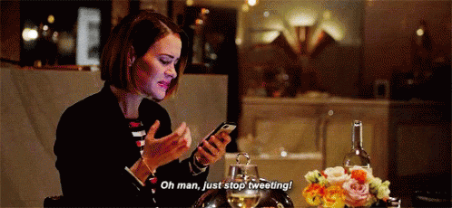
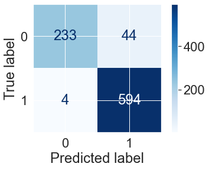
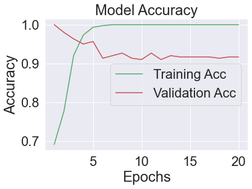
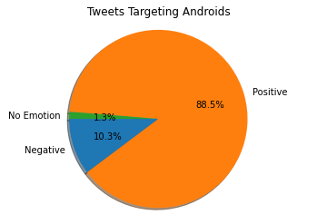
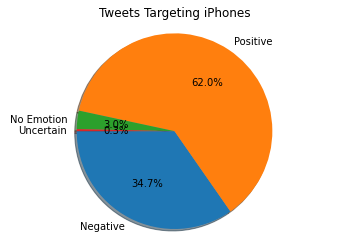

# Twitter Sentiment Analysis

##### [Slideshow PDF](pdfs/TrafficCollisionsChicago.pdf)

### Outline
* [Purpose](#Purpose)
* [Description of Data](#Description_of_Data)
* [Main Questions](#Main-Questions)
* [Summary Conclusions and Insights](#Summary-Conclusions-and-Insights)
* [Future Work](#Future-Work)

## Purpose

#### A client is looking to design and manufacture a new smart phone and will invariably compete with Apple and Google products. They have provided us with a data set of Tweets and would like more detail regarding negatively and positively charged Tweets directed at both iPhone OS and Android OS phones. 
##### Our challenges are -
##### * 1. To highlight any negative features of iPhones and Androids so that they can reduce them in their new product and 
##### * 2. To highlight positive features of iPhones and Androids so that they can implement or improve them in their own product
##### * 3. To provide recommendations that will improve their future product

## Tweet Content

The tweets in the data are focused on Apple and Google products. The Apple and Google product related tweets all mention SXSW (South by Southwest), a music festival in Austin, Texas.  

## Description of Data

The data consists of 3 original columns - Tweets, Subject of the Tweet, and the primary Emotion of the Tweet

## EDA and Preprocessing 

The tweets have been tokenized and lemmatized. Both a multiclass classifier and a binary classifier were built to predict the sentiment of a particular tweet.

## Supervised Learning Models 

### Binary Classifier Using RandomForest and Tf-Idf Vectorizer
#### 1 Denotes a positively charged tweet, 0 denotes a negatively charged tweet

### Multiclass Classifier Keras Neural Network
#### Validating Model Accuracy

## Main Questions
* Question 1: In tweets targeting either the iPhone or Android phones, which product is more often the subject of negatively charged emotions?
* Question 2: What words are most common in negative tweets about iPhones and Android phones?
* Question 3: What are some of the positive features commented about for both iPhones and Android phones?

## Notebook Table of Contents
### 1.1 Introduction
### 1.2 Table of Contents
### 1.3 EDA and Data Preprocessing
### 1.4 Modeling
### 1.5 Evaluate Models
### 1.6 Keras NN Binary
### 1.7 NLP Using Word2Vec
### 1.8 Keras NN Multiclass
### 1.9 - 1.11 Questions 1-3

## Summary Conclusions and Insights
* Question 1 Answer: 
* In creating a new phone product, keep in mind that users may want the option to have a more customizable user interface which the Android OS provides. We will need to look into more detail about what negative words users are including in their negative tweets that target iPhones to specifically determine users' complaints. 

### Proportion of Negative and Positive Tweets
#### As a proportion of totals, iPhones receive more negative attention from Tweeters

* Question 2 Answer: 
* The Android operating system was claimed to be buggy in addition to someone saying Android is painful and not sleek like Apple's iOS. Generally, users had less negative things to say as a percentage of total comments.
The iPhone was said to have failing battery or a battery charge that does not last long enough when the phone is in operation. Additionally, lack of signal became a problem in crowded areas but this is not typically a phone design issue but instead is an infrastructure problem.
Build a sleek phone with a simple to use Graphical User Interface. Have plenty of battery to power the phone for longer periods. Users would enjoy a feature like a backup battery, or a sleekly designed case that provides a full second charge without adding much volume.

* Question 3 Answer: 
* People are happiest when their phones are charged or charging.
The positive Android Tweets are in reference to parties or people just being excited about Android phones and challenging Apple's market share. Words used include party, team, good, win, market, fan, and excited. Individual observations are not about the function of the device but rather about being a part of a new group or trend.
The positive iPhone tweets center on batteries and charging/having a charged phone to be able to use at the music festival in Austin, Texas. Words most often used include case, thanks, free, charger, wow, and best. These observations are more about being able to use iPhone to do anything, including getting funding of $130,000 in order to make a movie with only the camera on an iPhone.

## Future Work
* Separate iPhone OS and Android OS tweets to look at different behaviors and word usage of those two groups
* Use Spacy NLP to look at Parts of Speech tagging of the bag of words
* Explore which words have the most positive and most negative connotations in tweets 

### Thank you!
