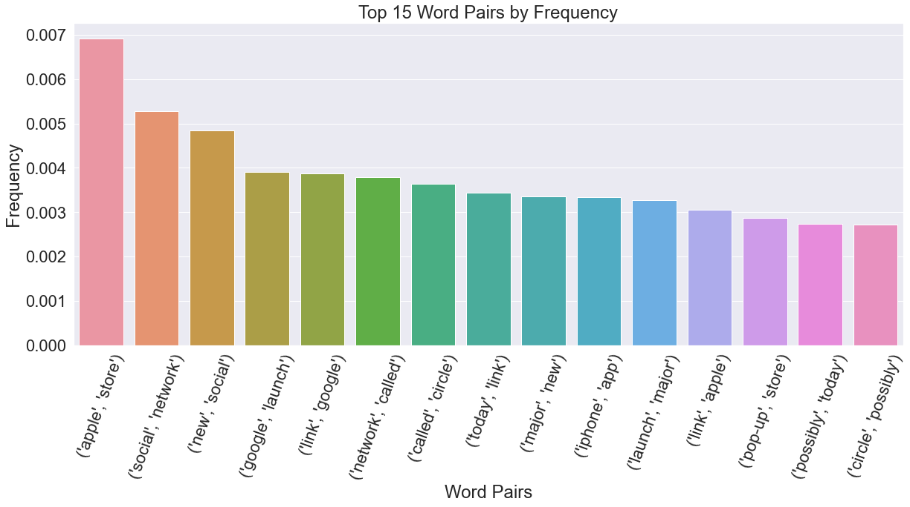

# Tweet Analysis - Apple and Google

#### Author: Joseph Denney
#### Email: joseph.d.denney@gmail.com
#### github: www.github.com/josephdenney/Tweet_Analysis

## Introduction

### Problem and Purpose

#### A client is looking to design and manufacture a new smart phone and will invariably compete with Apple and Google products. They have provided us with a data set of Tweets and would like more detail regarding negatively and positively charged Tweets directed at both iPhone OS and Android OS phones. 
##### Our challenges are -
##### * 1. To highlight any negative features of iPhones and Androids so that they can reduce them in their new product and 
##### * 2. To highlight positive features of iPhones and Androids so that they can implement or improve them in their own product
##### * 3. To provide recommendations that will improve their future product

## Table of Contents
#### 1.3 EDA and Data Preprocessing
#### 1.4 Modeling
#### 1.5 Evaluate Models
#### 1.6 Keras Neural Network Binary Classifier
#### 1.7 NLP Using Word2Vec
#### 1.8 Keras Neural Network Multiple Classifier
#### 1.9 Question 1 and Recommendation
#### 1.10 Question 2 and Recommendation
#### 1.11 Question 3 and Recommendation

## EDA and Data Preprocessing

### Library, function, and data imports


```python
import numpy as np
import pandas as pd
import spacy
import re
import nltk
import matplotlib.pyplot as plt
import logging
logging.basicConfig(format='%(asctime)s : %(levelname)s : %(message)s', 
                    level=logging.INFO)

from gensim.models import Word2Vec
from keras.models import Sequential
from keras.layers import Dense
from sklearn.preprocessing import MinMaxScaler, MaxAbsScaler
import seaborn as sns

from nltk.stem.wordnet import WordNetLemmatizer
import string
nltk.download('stopwords')
nltk.download('punkt')
nltk.download('wordnet')
from sklearn.pipeline import Pipeline
from nltk.corpus import stopwords
from nltk import word_tokenize, FreqDist
from applesauce import model_scoring, cost_benefit_analysis, evaluate_model
from applesauce import model_opt, single_model_opt

from sklearn.metrics import classification_report, confusion_matrix 
from sklearn.metrics import plot_confusion_matrix, accuracy_score
from sklearn.metrics import precision_recall_curve, f1_score, precision_score
from sklearn.metrics import recall_score
from sklearn.ensemble import RandomForestClassifier, AdaBoostClassifier 
from sklearn.ensemble import GradientBoostingClassifier 
from sklearn.naive_bayes import BernoulliNB, CategoricalNB, GaussianNB 
from sklearn.naive_bayes import MultinomialNB
from sklearn.feature_extraction.text import TfidfVectorizer,CountVectorizer 
from sklearn.feature_extraction.text import TfidfTransformer
from sklearn.model_selection import GridSearchCV, train_test_split
from sklearn.utils import resample

from keras.preprocessing.sequence import pad_sequences
from keras.layers import Input, Dense, LSTM, Embedding
from keras.layers import Dropout, Activation, Bidirectional, GlobalMaxPool1D
from keras.models import Sequential
from keras import initializers, regularizers, constraints, optimizers, layers
from keras.preprocessing import text, sequence
```

    [nltk_data] Downloading package stopwords to
    [nltk_data]     C:\Users\josep\AppData\Roaming\nltk_data...
    [nltk_data]   Package stopwords is already up-to-date!
    [nltk_data] Downloading package punkt to
    [nltk_data]     C:\Users\josep\AppData\Roaming\nltk_data...
    [nltk_data]   Package punkt is already up-to-date!
    [nltk_data] Downloading package wordnet to
    [nltk_data]     C:\Users\josep\AppData\Roaming\nltk_data...
    [nltk_data]   Package wordnet is already up-to-date!
    


```python
pattern = r"\@\w*"
```


```python
# regex has a cool function called search
mysearch = re.search(pattern, df['Tweet'][0])
mysearch
```


    <re.Match object; span=(1, 10), match='@wesley83'>


```python
myfind = re.findall(pattern, df['Tweet'][0])
myfind
```


    ['@wesley83']


```python

```


```python
nlp = spacy.load("en_core_web_sm")
```


```python
print(stopwords)
print(nlp.Defaults.stop_words) 
# view list of stopwords
```

    <WordListCorpusReader in '.../corpora/stopwords' (not loaded yet)>
    {'’d', 'since', 'thru', 'everywhere', 'within', 'forty', 'four', '‘ll', 'various', 'all', 'own', 'same', 'your', 'this', 'two', 'perhaps', 'indeed', 'against', 'regarding', 'before', 'more', 'yours', 'made', 'an', 'again', 'am', 'by', 'beforehand', 'make', 'than', 'yourself', 'third', 'is', 'often', 'there', 'empty', 'you', 'another', 'have', "'m", 'n’t', 'out', 'somehow', 'whence', 'either', 'after', 'anyone', 'back', 'due', 'onto', 'next', 'can', 'would', 'which', 'used', 'nine', 'whom', 'beyond', 'becomes', 'no', 'whose', 'unless', 'latterly', 'namely', 'while', 'whenever', 'in', 'between', 'done', 'last', 'least', 'up', 'over', 'say', 'were', 'below', 'alone', 'both', 'seeming', 'upon', 'wherein', '‘m', 'then', 'sixty', 'hereafter', "'s", 'nowhere', 'first', 'themselves', 'something', 'and', 'yourselves', '‘re', 'whether', 'do', 'off', 'full', 'did', 'many', '‘s', 'already', 'how', 'seem', 'along', 'until', 'around', 'yet', 'ca', 'it', 'whereas', 'being', 'take', 'what', 'their', "n't", 'ours', 'does', 'give', 'everyone', 'them', 'front', 'top', 'cannot', 'whoever', 'above', 'my', 'are', 'that', 'quite', 'seemed', 'he', 'sometime', 'well', '‘ve', 'really', 'each', 'among', 'will', 'should', 'wherever', 'they', 'towards', '’ll', 'when', 'whereupon', 'still', 'afterwards', "'re", 'nobody', 'become', 'few', 'these', 'fifty', 'elsewhere', 'per', '’re', 'further', 'must', 'be', 'myself', 'anything', 'neither', 'mine', 'other', 'amount', 'n‘t', 'very', 'rather', 'mostly', 'anywhere', 'if', '’ve', 'meanwhile', 'ourselves', 'throughout', 'not', 'move', 'doing', 'too', 'bottom', 'even', 'who', 'otherwise', 'down', 'however', 'sometimes', 'therein', 'beside', 'anyhow', 'but', 'becoming', 'without', 'latter', 'except', 'part', 'fifteen', 'our', 'almost', 'the', 'now', 'call', '’m', 'became', 'for', 'get', 'thence', 'thereupon', 'him', 'moreover', 'hence', 'hereby', 'besides', 'eleven', 'hers', 'where', 'has', 'although', 'noone', 'most', 'three', 'whereafter', 'serious', "'ve", 'eight', 'name', 'every', 'of', 'nothing', 'into', 'amongst', 'somewhere', 'also', 'those', 'twelve', 'please', 'one', 'ten', 'else', 'as', 'hereupon', 'whole', 'a', 'thus', 'her', 'behind', 'about', 'therefore', 'across', 'nor', 'others', 'us', 'much', 'using', 'several', 'i', 'former', 'go', 'herein', 'on', 'been', 'hundred', 'or', 'five', 'toward', 'his', 'only', 'to', 'always', 'such', 'herself', 'once', 'see', "'ll", 'here', 'was', 'she', 'just', 'never', 'any', 'together', 'during', 'whither', 'so', 'whereby', 'nevertheless', 'thereafter', 'at', 'with', 'though', 'had', 'anyway', 'none', 'six', 'from', 'someone', 'because', 'twenty', 'itself', "'d", 'show', 'thereby', 'me', 'whatever', 'under', 'we', 'why', 'ever', 'seems', 'some', 'through', 'keep', 'himself', '‘d', 'could', 'less', 'enough', 'put', 'may', 'everything', 'side', 're', 'its', 'might', 'via', '’s', 'formerly'}
    


```python
df = pd.read_csv('data/product_tweets.csv',encoding='latin1')
```


```python
df.info()
```

    <class 'pandas.core.frame.DataFrame'>
    RangeIndex: 9093 entries, 0 to 9092
    Data columns (total 3 columns):
     #   Column                                              Non-Null Count  Dtype 
    ---  ------                                              --------------  ----- 
     0   tweet_text                                          9092 non-null   object
     1   emotion_in_tweet_is_directed_at                     3291 non-null   object
     2   is_there_an_emotion_directed_at_a_brand_or_product  9093 non-null   object
    dtypes: object(3)
    memory usage: 213.2+ KB
    


```python
df.head()
```


<div>
<style scoped>
    .dataframe tbody tr th:only-of-type {
        vertical-align: middle;
    }

    .dataframe tbody tr th {
        vertical-align: top;
    }

    .dataframe thead th {
        text-align: right;
    }
</style>
<table border="1" class="dataframe">
  <thead>
    <tr style="text-align: right;">
      <th></th>
      <th>tweet_text</th>
      <th>emotion_in_tweet_is_directed_at</th>
      <th>is_there_an_emotion_directed_at_a_brand_or_product</th>
    </tr>
  </thead>
  <tbody>
    <tr>
      <th>0</th>
      <td>.@wesley83 I have a 3G iPhone. After 3 hrs twe...</td>
      <td>iPhone</td>
      <td>Negative emotion</td>
    </tr>
    <tr>
      <th>1</th>
      <td>@jessedee Know about @fludapp ? Awesome iPad/i...</td>
      <td>iPad or iPhone App</td>
      <td>Positive emotion</td>
    </tr>
    <tr>
      <th>2</th>
      <td>@swonderlin Can not wait for #iPad 2 also. The...</td>
      <td>iPad</td>
      <td>Positive emotion</td>
    </tr>
    <tr>
      <th>3</th>
      <td>@sxsw I hope this year's festival isn't as cra...</td>
      <td>iPad or iPhone App</td>
      <td>Negative emotion</td>
    </tr>
    <tr>
      <th>4</th>
      <td>@sxtxstate great stuff on Fri #SXSW: Marissa M...</td>
      <td>Google</td>
      <td>Positive emotion</td>
    </tr>
  </tbody>
</table>
</div>


```python
df['emotion_in_tweet_is_directed_at'].unique()
```


    array(['iPhone', 'iPad or iPhone App', 'iPad', 'Google', nan, 'Android',
           'Apple', 'Android App', 'Other Google product or service',
           'Other Apple product or service'], dtype=object)


```python
df['emotion_in_tweet_is_directed_at'].count()
```


    3291


### Data Exploration and Column Title Cleanup


```python
df['is_there_an_emotion_directed_at_a_brand_or_product'].unique()
```


    array(['Negative emotion', 'Positive emotion',
           'No emotion toward brand or product', "I can't tell"], dtype=object)


```python
df = df.rename(columns= {'is_there_an_emotion_directed_at_a_brand_or_product'
                         :'Emotion',
                         'emotion_in_tweet_is_directed_at': 'Platform'})
```


```python
df = df.rename(columns= {'tweet_text': 'Tweet'})
```


```python
df.head() 
```


<div>
<style scoped>
    .dataframe tbody tr th:only-of-type {
        vertical-align: middle;
    }

    .dataframe tbody tr th {
        vertical-align: top;
    }

    .dataframe thead th {
        text-align: right;
    }
</style>
<table border="1" class="dataframe">
  <thead>
    <tr style="text-align: right;">
      <th></th>
      <th>Tweet</th>
      <th>Platform</th>
      <th>Emotion</th>
    </tr>
  </thead>
  <tbody>
    <tr>
      <th>0</th>
      <td>.@wesley83 I have a 3G iPhone. After 3 hrs twe...</td>
      <td>iPhone</td>
      <td>Negative emotion</td>
    </tr>
    <tr>
      <th>1</th>
      <td>@jessedee Know about @fludapp ? Awesome iPad/i...</td>
      <td>iPad or iPhone App</td>
      <td>Positive emotion</td>
    </tr>
    <tr>
      <th>2</th>
      <td>@swonderlin Can not wait for #iPad 2 also. The...</td>
      <td>iPad</td>
      <td>Positive emotion</td>
    </tr>
    <tr>
      <th>3</th>
      <td>@sxsw I hope this year's festival isn't as cra...</td>
      <td>iPad or iPhone App</td>
      <td>Negative emotion</td>
    </tr>
    <tr>
      <th>4</th>
      <td>@sxtxstate great stuff on Fri #SXSW: Marissa M...</td>
      <td>Google</td>
      <td>Positive emotion</td>
    </tr>
  </tbody>
</table>
</div>


```python
df.groupby(df['Platform']).count()
```


<div>
<style scoped>
    .dataframe tbody tr th:only-of-type {
        vertical-align: middle;
    }

    .dataframe tbody tr th {
        vertical-align: top;
    }

    .dataframe thead th {
        text-align: right;
    }
</style>
<table border="1" class="dataframe">
  <thead>
    <tr style="text-align: right;">
      <th></th>
      <th>Tweet</th>
      <th>Emotion</th>
    </tr>
    <tr>
      <th>Platform</th>
      <th></th>
      <th></th>
    </tr>
  </thead>
  <tbody>
    <tr>
      <th>Android</th>
      <td>78</td>
      <td>78</td>
    </tr>
    <tr>
      <th>Android App</th>
      <td>81</td>
      <td>81</td>
    </tr>
    <tr>
      <th>Apple</th>
      <td>661</td>
      <td>661</td>
    </tr>
    <tr>
      <th>Google</th>
      <td>430</td>
      <td>430</td>
    </tr>
    <tr>
      <th>Other Apple product or service</th>
      <td>35</td>
      <td>35</td>
    </tr>
    <tr>
      <th>Other Google product or service</th>
      <td>293</td>
      <td>293</td>
    </tr>
    <tr>
      <th>iPad</th>
      <td>946</td>
      <td>946</td>
    </tr>
    <tr>
      <th>iPad or iPhone App</th>
      <td>470</td>
      <td>470</td>
    </tr>
    <tr>
      <th>iPhone</th>
      <td>297</td>
      <td>297</td>
    </tr>
  </tbody>
</table>
</div>


### Dummify Target Column


```python
df_dummify = pd.get_dummies(df['Emotion'])
```


```python
df_dummify.head()
```


<div>
<style scoped>
    .dataframe tbody tr th:only-of-type {
        vertical-align: middle;
    }

    .dataframe tbody tr th {
        vertical-align: top;
    }

    .dataframe thead th {
        text-align: right;
    }
</style>
<table border="1" class="dataframe">
  <thead>
    <tr style="text-align: right;">
      <th></th>
      <th>I can't tell</th>
      <th>Negative emotion</th>
      <th>No emotion toward brand or product</th>
      <th>Positive emotion</th>
    </tr>
  </thead>
  <tbody>
    <tr>
      <th>0</th>
      <td>0</td>
      <td>1</td>
      <td>0</td>
      <td>0</td>
    </tr>
    <tr>
      <th>1</th>
      <td>0</td>
      <td>0</td>
      <td>0</td>
      <td>1</td>
    </tr>
    <tr>
      <th>2</th>
      <td>0</td>
      <td>0</td>
      <td>0</td>
      <td>1</td>
    </tr>
    <tr>
      <th>3</th>
      <td>0</td>
      <td>1</td>
      <td>0</td>
      <td>0</td>
    </tr>
    <tr>
      <th>4</th>
      <td>0</td>
      <td>0</td>
      <td>0</td>
      <td>1</td>
    </tr>
  </tbody>
</table>
</div>


```python
df_dummify.sum() # class bias 
```


    I can't tell                           156
    Negative emotion                       570
    No emotion toward brand or product    5389
    Positive emotion                      2978
    dtype: int64


```python
df.info()
df = pd.merge(df, df_dummify, how='outer',on=df.index) 
# ran this code, dummify emotion data
```

    <class 'pandas.core.frame.DataFrame'>
    RangeIndex: 9093 entries, 0 to 9092
    Data columns (total 3 columns):
     #   Column    Non-Null Count  Dtype 
    ---  ------    --------------  ----- 
     0   Tweet     9092 non-null   object
     1   Platform  3291 non-null   object
     2   Emotion   9093 non-null   object
    dtypes: object(3)
    memory usage: 213.2+ KB
    


```python
df.info()
```

    <class 'pandas.core.frame.DataFrame'>
    Int64Index: 9093 entries, 0 to 9092
    Data columns (total 8 columns):
     #   Column                              Non-Null Count  Dtype 
    ---  ------                              --------------  ----- 
     0   key_0                               9093 non-null   int64 
     1   Tweet                               9092 non-null   object
     2   Platform                            3291 non-null   object
     3   Emotion                             9093 non-null   object
     4   I can't tell                        9093 non-null   uint8 
     5   Negative emotion                    9093 non-null   uint8 
     6   No emotion toward brand or product  9093 non-null   uint8 
     7   Positive emotion                    9093 non-null   uint8 
    dtypes: int64(1), object(3), uint8(4)
    memory usage: 390.7+ KB
    


```python
df.head()
```


<div>
<style scoped>
    .dataframe tbody tr th:only-of-type {
        vertical-align: middle;
    }

    .dataframe tbody tr th {
        vertical-align: top;
    }

    .dataframe thead th {
        text-align: right;
    }
</style>
<table border="1" class="dataframe">
  <thead>
    <tr style="text-align: right;">
      <th></th>
      <th>key_0</th>
      <th>Tweet</th>
      <th>Platform</th>
      <th>Emotion</th>
      <th>I can't tell</th>
      <th>Negative emotion</th>
      <th>No emotion toward brand or product</th>
      <th>Positive emotion</th>
    </tr>
  </thead>
  <tbody>
    <tr>
      <th>0</th>
      <td>0</td>
      <td>.@wesley83 I have a 3G iPhone. After 3 hrs twe...</td>
      <td>iPhone</td>
      <td>Negative emotion</td>
      <td>0</td>
      <td>1</td>
      <td>0</td>
      <td>0</td>
    </tr>
    <tr>
      <th>1</th>
      <td>1</td>
      <td>@jessedee Know about @fludapp ? Awesome iPad/i...</td>
      <td>iPad or iPhone App</td>
      <td>Positive emotion</td>
      <td>0</td>
      <td>0</td>
      <td>0</td>
      <td>1</td>
    </tr>
    <tr>
      <th>2</th>
      <td>2</td>
      <td>@swonderlin Can not wait for #iPad 2 also. The...</td>
      <td>iPad</td>
      <td>Positive emotion</td>
      <td>0</td>
      <td>0</td>
      <td>0</td>
      <td>1</td>
    </tr>
    <tr>
      <th>3</th>
      <td>3</td>
      <td>@sxsw I hope this year's festival isn't as cra...</td>
      <td>iPad or iPhone App</td>
      <td>Negative emotion</td>
      <td>0</td>
      <td>1</td>
      <td>0</td>
      <td>0</td>
    </tr>
    <tr>
      <th>4</th>
      <td>4</td>
      <td>@sxtxstate great stuff on Fri #SXSW: Marissa M...</td>
      <td>Google</td>
      <td>Positive emotion</td>
      <td>0</td>
      <td>0</td>
      <td>0</td>
      <td>1</td>
    </tr>
  </tbody>
</table>
</div>


```python
df = df.rename(columns = {"I can't tell": "Uncertain", 
                          'Negative emotion': 'Negative', 
                          'No emotion toward brand or product': 'No Emotion',
                          'Positive emotion':'Positive'})
```


```python
df = df.drop(columns='key_0')
df.head()
df.to_csv('Full_DF')
```


```python
corpus = list(df['Tweet']) # verify corpus list
corpus[:10]
```


    ['.@wesley83 I have a 3G iPhone. After 3 hrs tweeting at #RISE_Austin, it was dead!  I need to upgrade. Plugin stations at #SXSW.',
     "@jessedee Know about @fludapp ? Awesome iPad/iPhone app that you'll likely appreciate for its design. Also, they're giving free Ts at #SXSW",
     '@swonderlin Can not wait for #iPad 2 also. They should sale them down at #SXSW.',
     "@sxsw I hope this year's festival isn't as crashy as this year's iPhone app. #sxsw",
     "@sxtxstate great stuff on Fri #SXSW: Marissa Mayer (Google), Tim O'Reilly (tech books/conferences) &amp; Matt Mullenweg (Wordpress)",
     '@teachntech00 New iPad Apps For #SpeechTherapy And Communication Are Showcased At The #SXSW Conference http://ht.ly/49n4M #iear #edchat #asd',
     nan,
     '#SXSW is just starting, #CTIA is around the corner and #googleio is only a hop skip and a jump from there, good time to be an #android fan',
     'Beautifully smart and simple idea RT @madebymany @thenextweb wrote about our #hollergram iPad app for #sxsw! http://bit.ly/ieaVOB',
     'Counting down the days to #sxsw plus strong Canadian dollar means stock up on Apple gear']


### Platform Negative Tweet Table


```python
df.groupby(by=df['Platform']).sum()
```


<div>
<style scoped>
    .dataframe tbody tr th:only-of-type {
        vertical-align: middle;
    }

    .dataframe tbody tr th {
        vertical-align: top;
    }

    .dataframe thead th {
        text-align: right;
    }
</style>
<table border="1" class="dataframe">
  <thead>
    <tr style="text-align: right;">
      <th></th>
      <th>Uncertain</th>
      <th>Negative</th>
      <th>No Emotion</th>
      <th>Positive</th>
    </tr>
    <tr>
      <th>Platform</th>
      <th></th>
      <th></th>
      <th></th>
      <th></th>
    </tr>
  </thead>
  <tbody>
    <tr>
      <th>Android</th>
      <td>0.0</td>
      <td>8.0</td>
      <td>1.0</td>
      <td>69.0</td>
    </tr>
    <tr>
      <th>Android App</th>
      <td>0.0</td>
      <td>8.0</td>
      <td>1.0</td>
      <td>72.0</td>
    </tr>
    <tr>
      <th>Apple</th>
      <td>2.0</td>
      <td>95.0</td>
      <td>21.0</td>
      <td>543.0</td>
    </tr>
    <tr>
      <th>Google</th>
      <td>1.0</td>
      <td>68.0</td>
      <td>15.0</td>
      <td>346.0</td>
    </tr>
    <tr>
      <th>Other Apple product or service</th>
      <td>0.0</td>
      <td>2.0</td>
      <td>1.0</td>
      <td>32.0</td>
    </tr>
    <tr>
      <th>Other Google product or service</th>
      <td>1.0</td>
      <td>47.0</td>
      <td>9.0</td>
      <td>236.0</td>
    </tr>
    <tr>
      <th>iPad</th>
      <td>4.0</td>
      <td>125.0</td>
      <td>24.0</td>
      <td>793.0</td>
    </tr>
    <tr>
      <th>iPad or iPhone App</th>
      <td>0.0</td>
      <td>63.0</td>
      <td>10.0</td>
      <td>397.0</td>
    </tr>
    <tr>
      <th>iPhone</th>
      <td>1.0</td>
      <td>103.0</td>
      <td>9.0</td>
      <td>184.0</td>
    </tr>
  </tbody>
</table>
</div>


### Tokenize and Create Bag of Words


```python
tokenz = word_tokenize(','.join(str(v) for v in corpus))
```


```python
tokenz[:10]
```


    ['.', '@', 'wesley83', 'I', 'have', 'a', '3G', 'iPhone', '.', 'After']


### Create Stopwords List


```python
stopword_list = list(nlp.Defaults.stop_words)
len(nlp.Defaults.stop_words)
```


    326


```python
stopword_list
```


    ['’d',
     'since',
     'thru',
     'everywhere',
     'within',
     'forty',
     'four',
     '‘ll',
     'various',
     'all',
     'own',
     'same',
     'your',
     'this',
     'two',
     'perhaps',
     'indeed',
     'against',
     'regarding',
     'before',
     'more',
     'yours',
     'made',
     'an',
     'again',
     'am',
     'by',
     'beforehand',
     'make',
     'than',
     'yourself',
     'third',
     'is',
     'often',
     'there',
     'empty',
     'you',
     'another',
     'have',
     "'m",
     'n’t',
     'out',
     'somehow',
     'whence',
     'either',
     'after',
     'anyone',
     'back',
     'due',
     'onto',
     'next',
     'can',
     'would',
     'which',
     'used',
     'nine',
     'whom',
     'beyond',
     'becomes',
     'no',
     'whose',
     'unless',
     'latterly',
     'namely',
     'while',
     'whenever',
     'in',
     'between',
     'done',
     'last',
     'least',
     'up',
     'over',
     'say',
     'were',
     'below',
     'alone',
     'both',
     'seeming',
     'upon',
     'wherein',
     '‘m',
     'then',
     'sixty',
     'hereafter',
     "'s",
     'nowhere',
     'first',
     'themselves',
     'something',
     'and',
     'yourselves',
     '‘re',
     'whether',
     'do',
     'off',
     'full',
     'did',
     'many',
     '‘s',
     'already',
     'how',
     'seem',
     'along',
     'until',
     'around',
     'yet',
     'ca',
     'it',
     'whereas',
     'being',
     'take',
     'what',
     'their',
     "n't",
     'ours',
     'does',
     'give',
     'everyone',
     'them',
     'front',
     'top',
     'cannot',
     'whoever',
     'above',
     'my',
     'are',
     'that',
     'quite',
     'seemed',
     'he',
     'sometime',
     'well',
     '‘ve',
     'really',
     'each',
     'among',
     'will',
     'should',
     'wherever',
     'they',
     'towards',
     '’ll',
     'when',
     'whereupon',
     'still',
     'afterwards',
     "'re",
     'nobody',
     'become',
     'few',
     'these',
     'fifty',
     'elsewhere',
     'per',
     '’re',
     'further',
     'must',
     'be',
     'myself',
     'anything',
     'neither',
     'mine',
     'other',
     'amount',
     'n‘t',
     'very',
     'rather',
     'mostly',
     'anywhere',
     'if',
     '’ve',
     'meanwhile',
     'ourselves',
     'throughout',
     'not',
     'move',
     'doing',
     'too',
     'bottom',
     'even',
     'who',
     'otherwise',
     'down',
     'however',
     'sometimes',
     'therein',
     'beside',
     'anyhow',
     'but',
     'becoming',
     'without',
     'latter',
     'except',
     'part',
     'fifteen',
     'our',
     'almost',
     'the',
     'now',
     'call',
     '’m',
     'became',
     'for',
     'get',
     'thence',
     'thereupon',
     'him',
     'moreover',
     'hence',
     'hereby',
     'besides',
     'eleven',
     'hers',
     'where',
     'has',
     'although',
     'noone',
     'most',
     'three',
     'whereafter',
     'serious',
     "'ve",
     'eight',
     'name',
     'every',
     'of',
     'nothing',
     'into',
     'amongst',
     'somewhere',
     'also',
     'those',
     'twelve',
     'please',
     'one',
     'ten',
     'else',
     'as',
     'hereupon',
     'whole',
     'a',
     'thus',
     'her',
     'behind',
     'about',
     'therefore',
     'across',
     'nor',
     'others',
     'us',
     'much',
     'using',
     'several',
     'i',
     'former',
     'go',
     'herein',
     'on',
     'been',
     'hundred',
     'or',
     'five',
     'toward',
     'his',
     'only',
     'to',
     'always',
     'such',
     'herself',
     'once',
     'see',
     "'ll",
     'here',
     'was',
     'she',
     'just',
     'never',
     'any',
     'together',
     'during',
     'whither',
     'so',
     'whereby',
     'nevertheless',
     'thereafter',
     'at',
     'with',
     'though',
     'had',
     'anyway',
     'none',
     'six',
     'from',
     'someone',
     'because',
     'twenty',
     'itself',
     "'d",
     'show',
     'thereby',
     'me',
     'whatever',
     'under',
     'we',
     'why',
     'ever',
     'seems',
     'some',
     'through',
     'keep',
     'himself',
     '‘d',
     'could',
     'less',
     'enough',
     'put',
     'may',
     'everything',
     'side',
     're',
     'its',
     'might',
     'via',
     '’s',
     'formerly']


```python
stopword_list.extend(string.punctuation)
```


```python
len(stopword_list)
```


    358


```python
stopword_list.extend(stopwords.words('english'))
```


```python
len(stopword_list)
```


    537


```python
additional_punc = ['“','”','...',"''",'’','``','https','rt','\.+']
stopword_list.extend(additional_punc)
stopword_list[-10:]
```


    ["wouldn't", '“', '”', '...', "''", '’', '``', 'https', 'rt', '\\.+']


### Remove Stopwords and Additional Punctuation from the Data


```python
stopped_tokenz = [word.lower() for word in tokenz if word.lower() 
                  not in stopword_list]
```


```python
freq = FreqDist(stopped_tokenz)
freq.most_common(50)
```


    [('sxsw', 9418),
     ('mention', 7120),
     ('link', 4313),
     ('google', 2593),
     ('ipad', 2432),
     ('apple', 2301),
     ('quot', 1696),
     ('iphone', 1516),
     ('store', 1472),
     ('2', 1114),
     ('new', 1090),
     ('austin', 959),
     ('amp', 836),
     ('app', 810),
     ('circles', 658),
     ('launch', 653),
     ('social', 647),
     ('android', 574),
     ('today', 574),
     ('network', 465),
     ('ipad2', 457),
     ('pop-up', 420),
     ('line', 405),
     ('free', 387),
     ('called', 361),
     ('party', 346),
     ('sxswi', 340),
     ('mobile', 338),
     ('major', 301),
     ('like', 290),
     ('time', 271),
     ('temporary', 264),
     ('opening', 257),
     ('possibly', 240),
     ('people', 226),
     ('downtown', 225),
     ('apps', 224),
     ('great', 222),
     ('maps', 219),
     ('going', 217),
     ('check', 216),
     ('mayer', 214),
     ('day', 214),
     ('open', 210),
     ('popup', 209),
     ('need', 205),
     ('marissa', 189),
     ('got', 185),
     ('w/', 182),
     ('know', 180)]


### Lemmatize the Data, Utilize Regex to Find and Remove URL's, Tags, other Misc


```python
additional_misc = ['sxsw','mention',r'[a-zA-Z]+\'?s]',
                   r"(http[s]?://\w*\.\w*/+\w+)", r'\#\w*', 
                   r'RT [@]?\w*:', r'\@\w*',r"\d$",r"^\d",
                   r"([a-zA-Z]+(?:'[a-z]+)?)",r'\d.',r'\d','RT',
                   r'^http[s]?','za'] #[A-Z]{2,20} remove caps like MAGA and CDT
stopword_list.extend(additional_misc)
stopword_list.extend(['0', '1', '2', '3', '4', '5', '6', '7', '8', '9'])
```


```python
additional_misc = [r'\@\w*']
stopword_list.extend(additional_misc)
stopword_list.extend(['0', '1', '2', '3', '4', '5', '6', '7', '8', '9'])
```


```python

```


```python
lemmatizer = WordNetLemmatizer()
```


```python
clean_stopped_tokenz = [word.lower() for word in stopped_tokenz if word 
                        not in stopword_list]
clean_lemmatized_tokenz = [lemmatizer.lemmatize(word.lower()) for word 
                           in stopped_tokenz if word not in stopword_list]
```


```python
freq_clean_lemma = FreqDist(clean_lemmatized_tokenz)
freq_lemma = freq_clean_lemma.most_common(5000)
freq_lemma2 = freq_clean_lemma.most_common(25)
```


```python
total_word_count = len(clean_lemmatized_tokenz)
```


```python
lemma_word_count = sum(freq_clean_lemma.values()) # just a number
```


```python
for word in freq_lemma2: # separate both classes, positive and negative
    normalized_freq = word[1] / lemma_word_count
    print(word, "----", "{:.3f}".format(normalized_freq*100),"%")
```

    ('link', 4324) ---- 5.004 %
    ('google', 2594) ---- 3.002 %
    ('ipad', 2432) ---- 2.814 %
    ('apple', 2304) ---- 2.666 %
    ('quot', 1696) ---- 1.963 %
    ('iphone', 1516) ---- 1.754 %
    ('store', 1511) ---- 1.749 %
    ('new', 1090) ---- 1.261 %
    ('austin', 960) ---- 1.111 %
    ('amp', 836) ---- 0.967 %
    ('app', 810) ---- 0.937 %
    ('launch', 691) ---- 0.800 %
    ('circle', 673) ---- 0.779 %
    ('social', 647) ---- 0.749 %
    ('android', 574) ---- 0.664 %
    ('today', 574) ---- 0.664 %
    ('network', 473) ---- 0.547 %
    ('ipad2', 457) ---- 0.529 %
    ('line', 442) ---- 0.512 %
    ('pop-up', 422) ---- 0.488 %
    ('free', 387) ---- 0.448 %
    ('party', 386) ---- 0.447 %
    ('called', 361) ---- 0.418 %
    ('mobile', 340) ---- 0.393 %
    ('sxswi', 340) ---- 0.393 %
    


```python
# from wordcloud import WordCloud

# ## Initalize a WordCloud with our stopwords_list and no bigrams
# wordcloud = WordCloud(stopwords=stopword_list,collocations=False)

# ## Generate wordcloud from stopped_tokens
# wordcloud.generate(','.join(clean_lemmatized_tokenz))

# ## Plot with matplotlib
# plt.figure(figsize = (12, 12), facecolor = None) 
# plt.imshow(wordcloud) 
# plt.axis('off')
```


```python
bigram_measures = nltk.collocations.BigramAssocMeasures()
tweet_finder = nltk.BigramCollocationFinder.from_words(clean_lemmatized_tokenz)
tweets_scored = tweet_finder.score_ngrams(bigram_measures.raw_freq)
```


```python
word_pairs = pd.DataFrame(tweets_scored, columns=["Word","Freq"]).head(20)
word_pairs
```


<div>
<style scoped>
    .dataframe tbody tr th:only-of-type {
        vertical-align: middle;
    }

    .dataframe tbody tr th {
        vertical-align: top;
    }

    .dataframe thead th {
        text-align: right;
    }
</style>
<table border="1" class="dataframe">
  <thead>
    <tr style="text-align: right;">
      <th></th>
      <th>Word</th>
      <th>Freq</th>
    </tr>
  </thead>
  <tbody>
    <tr>
      <th>0</th>
      <td>(apple, store)</td>
      <td>0.006920</td>
    </tr>
    <tr>
      <th>1</th>
      <td>(social, network)</td>
      <td>0.005277</td>
    </tr>
    <tr>
      <th>2</th>
      <td>(new, social)</td>
      <td>0.004837</td>
    </tr>
    <tr>
      <th>3</th>
      <td>(google, launch)</td>
      <td>0.003912</td>
    </tr>
    <tr>
      <th>4</th>
      <td>(link, google)</td>
      <td>0.003877</td>
    </tr>
    <tr>
      <th>5</th>
      <td>(network, called)</td>
      <td>0.003784</td>
    </tr>
    <tr>
      <th>6</th>
      <td>(called, circle)</td>
      <td>0.003634</td>
    </tr>
    <tr>
      <th>7</th>
      <td>(today, link)</td>
      <td>0.003437</td>
    </tr>
    <tr>
      <th>8</th>
      <td>(major, new)</td>
      <td>0.003356</td>
    </tr>
    <tr>
      <th>9</th>
      <td>(iphone, app)</td>
      <td>0.003333</td>
    </tr>
    <tr>
      <th>10</th>
      <td>(launch, major)</td>
      <td>0.003264</td>
    </tr>
    <tr>
      <th>11</th>
      <td>(link, apple)</td>
      <td>0.003055</td>
    </tr>
    <tr>
      <th>12</th>
      <td>(pop-up, store)</td>
      <td>0.002870</td>
    </tr>
    <tr>
      <th>13</th>
      <td>(possibly, today)</td>
      <td>0.002731</td>
    </tr>
    <tr>
      <th>14</th>
      <td>(circle, possibly)</td>
      <td>0.002720</td>
    </tr>
    <tr>
      <th>15</th>
      <td>(apple, opening)</td>
      <td>0.002615</td>
    </tr>
    <tr>
      <th>16</th>
      <td>(google, circle)</td>
      <td>0.002430</td>
    </tr>
    <tr>
      <th>17</th>
      <td>(store, austin)</td>
      <td>0.002268</td>
    </tr>
    <tr>
      <th>18</th>
      <td>(temporary, store)</td>
      <td>0.002234</td>
    </tr>
    <tr>
      <th>19</th>
      <td>(downtown, austin)</td>
      <td>0.002199</td>
    </tr>
  </tbody>
</table>
</div>


```python
fig_dims = (20,8)
fig, ax = plt.subplots(figsize=fig_dims)
sns.set(font_scale=2)
sns.set_style("darkgrid")
palette = sns.set_palette("dark")
ax = sns.barplot(x=word_pairs.head(15)['Word'], y=word_pairs.head(15)['Freq'],
                 palette=palette)
ax.set(xlabel="Word Pairs",ylabel="Frequency")
plt.ticklabel_format(style='plain',axis='y')
plt.xticks(rotation=70)
plt.title('Top 15 Word Pairs by Frequency')
plt.show()
```


    

    


```python
tweet_pmi_finder = nltk.BigramCollocationFinder.from_words(clean_lemmatized_tokenz)
tweet_pmi_finder.apply_freq_filter(5)

tweet_pmi_scored = tweet_pmi_finder.score_ngrams(bigram_measures.pmi)
```


```python
PMI_list = pd.DataFrame(tweet_pmi_scored, columns=["Words","PMI"]).head(20)
PMI_list = PMI_list[PMI_list.PMI < 14]
PMI_list
```


<div>
<style scoped>
    .dataframe tbody tr th:only-of-type {
        vertical-align: middle;
    }

    .dataframe tbody tr th {
        vertical-align: top;
    }

    .dataframe thead th {
        text-align: right;
    }
</style>
<table border="1" class="dataframe">
  <thead>
    <tr style="text-align: right;">
      <th></th>
      <th>Words</th>
      <th>PMI</th>
    </tr>
  </thead>
  <tbody>
    <tr>
      <th>1</th>
      <td>(jc, penney)</td>
      <td>13.813948</td>
    </tr>
    <tr>
      <th>2</th>
      <td>(knitted, staircase)</td>
      <td>13.813948</td>
    </tr>
    <tr>
      <th>3</th>
      <td>(naomi, campbell)</td>
      <td>13.813948</td>
    </tr>
    <tr>
      <th>4</th>
      <td>(parking, 5-10)</td>
      <td>13.813948</td>
    </tr>
    <tr>
      <th>5</th>
      <td>(pauly, celebs)</td>
      <td>13.813948</td>
    </tr>
    <tr>
      <th>6</th>
      <td>(98, accuracy)</td>
      <td>13.591556</td>
    </tr>
    <tr>
      <th>7</th>
      <td>(aron, pilhofer)</td>
      <td>13.591556</td>
    </tr>
    <tr>
      <th>8</th>
      <td>(charlie, sheen)</td>
      <td>13.591556</td>
    </tr>
    <tr>
      <th>9</th>
      <td>(lynn, teo)</td>
      <td>13.591556</td>
    </tr>
    <tr>
      <th>10</th>
      <td>(sheen, goddess)</td>
      <td>13.591556</td>
    </tr>
    <tr>
      <th>11</th>
      <td>(elusive, 'power)</td>
      <td>13.398911</td>
    </tr>
    <tr>
      <th>12</th>
      <td>(zazzlsxsw, you‰ûªll)</td>
      <td>13.398911</td>
    </tr>
    <tr>
      <th>13</th>
      <td>(cameron, sinclair)</td>
      <td>13.398911</td>
    </tr>
    <tr>
      <th>14</th>
      <td>(sinclair, spearhead)</td>
      <td>13.398911</td>
    </tr>
    <tr>
      <th>15</th>
      <td>(staircase, attendance)</td>
      <td>13.398911</td>
    </tr>
    <tr>
      <th>16</th>
      <td>(likeability, virgin)</td>
      <td>13.328521</td>
    </tr>
    <tr>
      <th>17</th>
      <td>(14-day, return)</td>
      <td>13.228986</td>
    </tr>
    <tr>
      <th>18</th>
      <td>(launchrock, comp)</td>
      <td>13.228986</td>
    </tr>
    <tr>
      <th>19</th>
      <td>(participating, launchrock)</td>
      <td>13.228986</td>
    </tr>
  </tbody>
</table>
</div>


```python
fig_dims = (20,8)
fig, ax = plt.subplots(figsize=fig_dims)
sns.set(font_scale=2)
sns.set_style("darkgrid")
palette = sns.set_palette("dark")
ax = sns.barplot(x=PMI_list.head(15)['Words'], y=PMI_list.head(15)['PMI'], 
                 palette=palette)
ax.set(xlabel="PMI Pairs",ylabel="Frequency")
plt.ylim([13,14.5])
plt.ticklabel_format(style='plain',axis='y')
plt.xticks(rotation=70)
plt.title('Top 15 Word Pairs by PMI')
plt.show()
```


    

    


```python
df1 = df
df.head()
```


<div>
<style scoped>
    .dataframe tbody tr th:only-of-type {
        vertical-align: middle;
    }

    .dataframe tbody tr th {
        vertical-align: top;
    }

    .dataframe thead th {
        text-align: right;
    }
</style>
<table border="1" class="dataframe">
  <thead>
    <tr style="text-align: right;">
      <th></th>
      <th>Tweet</th>
      <th>Platform</th>
      <th>Emotion</th>
      <th>Uncertain</th>
      <th>Negative</th>
      <th>No Emotion</th>
      <th>Positive</th>
    </tr>
  </thead>
  <tbody>
    <tr>
      <th>0</th>
      <td>.@wesley83 I have a 3G iPhone. After 3 hrs twe...</td>
      <td>iPhone</td>
      <td>Negative emotion</td>
      <td>0</td>
      <td>1</td>
      <td>0</td>
      <td>0</td>
    </tr>
    <tr>
      <th>1</th>
      <td>@jessedee Know about @fludapp ? Awesome iPad/i...</td>
      <td>iPad or iPhone App</td>
      <td>Positive emotion</td>
      <td>0</td>
      <td>0</td>
      <td>0</td>
      <td>1</td>
    </tr>
    <tr>
      <th>2</th>
      <td>@swonderlin Can not wait for #iPad 2 also. The...</td>
      <td>iPad</td>
      <td>Positive emotion</td>
      <td>0</td>
      <td>0</td>
      <td>0</td>
      <td>1</td>
    </tr>
    <tr>
      <th>3</th>
      <td>@sxsw I hope this year's festival isn't as cra...</td>
      <td>iPad or iPhone App</td>
      <td>Negative emotion</td>
      <td>0</td>
      <td>1</td>
      <td>0</td>
      <td>0</td>
    </tr>
    <tr>
      <th>4</th>
      <td>@sxtxstate great stuff on Fri #SXSW: Marissa M...</td>
      <td>Google</td>
      <td>Positive emotion</td>
      <td>0</td>
      <td>0</td>
      <td>0</td>
      <td>1</td>
    </tr>
  </tbody>
</table>
</div>


```python
df1 = df1.drop(columns=['Uncertain','No Emotion'])
# Turn negative and positive columns into one column of just negatives 
# and positive.
df1 = df1[df1['Emotion'] != "No emotion toward brand or product"]
df1 = df1[df1['Emotion'] != "I can't tell"]
df1 = df1.drop(columns='Negative')
df1 = df1.rename(columns={'Positive': 'Positive_Bin'})
df1.head()
```


<div>
<style scoped>
    .dataframe tbody tr th:only-of-type {
        vertical-align: middle;
    }

    .dataframe tbody tr th {
        vertical-align: top;
    }

    .dataframe thead th {
        text-align: right;
    }
</style>
<table border="1" class="dataframe">
  <thead>
    <tr style="text-align: right;">
      <th></th>
      <th>Tweet</th>
      <th>Platform</th>
      <th>Emotion</th>
      <th>Positive_Bin</th>
    </tr>
  </thead>
  <tbody>
    <tr>
      <th>0</th>
      <td>.@wesley83 I have a 3G iPhone. After 3 hrs twe...</td>
      <td>iPhone</td>
      <td>Negative emotion</td>
      <td>0</td>
    </tr>
    <tr>
      <th>1</th>
      <td>@jessedee Know about @fludapp ? Awesome iPad/i...</td>
      <td>iPad or iPhone App</td>
      <td>Positive emotion</td>
      <td>1</td>
    </tr>
    <tr>
      <th>2</th>
      <td>@swonderlin Can not wait for #iPad 2 also. The...</td>
      <td>iPad</td>
      <td>Positive emotion</td>
      <td>1</td>
    </tr>
    <tr>
      <th>3</th>
      <td>@sxsw I hope this year's festival isn't as cra...</td>
      <td>iPad or iPhone App</td>
      <td>Negative emotion</td>
      <td>0</td>
    </tr>
    <tr>
      <th>4</th>
      <td>@sxtxstate great stuff on Fri #SXSW: Marissa M...</td>
      <td>Google</td>
      <td>Positive emotion</td>
      <td>1</td>
    </tr>
  </tbody>
</table>
</div>


```python
df1.to_csv('Tweet.csv')
```

### Create Upsampled Data


```python
df_majority = df1.loc[df1['Positive_Bin']==1]
df_minority = df1.loc[df1['Positive_Bin']==0]
```


```python
df_minority.shape
```


    (570, 4)


```python
df_majority.shape
```


    (2978, 4)


```python
df_min_sample = resample(df_minority, replace=True, n_samples=1000, 
                         random_state=42)
```


```python
df_maj_sample = resample(df_majority, replace=True, n_samples=2500, 
                         random_state=42)
```


```python
df_upsampled = pd.concat([df_min_sample, df_maj_sample], axis=0)
df_upsampled.shape
```


    (3500, 4)


```python
X, y = df_upsampled['Tweet'], df_upsampled['Positive_Bin']
```


```python
df_upsampled.to_csv('Upsampled.csv')
```

## Modeling

### Train/Test Split


```python
from sklearn.model_selection import train_test_split
X_train, X_test, y_train, y_test = train_test_split(X, y, random_state=42)
```


```python
df1.info()
```

    <class 'pandas.core.frame.DataFrame'>
    Int64Index: 3548 entries, 0 to 9088
    Data columns (total 4 columns):
     #   Column        Non-Null Count  Dtype 
    ---  ------        --------------  ----- 
     0   Tweet         3548 non-null   object
     1   Platform      3191 non-null   object
     2   Emotion       3548 non-null   object
     3   Positive_Bin  3548 non-null   uint8 
    dtypes: object(3), uint8(1)
    memory usage: 114.3+ KB
    


```python
y_train.value_counts(0)
y_test.value_counts(1)
```

    2020-12-30 10:37:01,139 : INFO : NumExpr defaulting to 8 threads.
    


    1    0.683429
    0    0.316571
    Name: Positive_Bin, dtype: float64


### Vectorize and Tokenize with Count Vectorizer and Tf Idf


```python
from sklearn.feature_extraction.text import TfidfVectorizer, CountVectorizer, TfidfTransformer
from sklearn.ensemble import RandomForestClassifier

tokenizer = nltk.TweetTokenizer(preserve_case=False)

vectorizer = CountVectorizer(tokenizer=tokenizer.tokenize,
                             stop_words=stopword_list,decode_error='ignore')
```


```python
X_train_count = vectorizer.fit_transform(X_train)
X_test_count = vectorizer.transform(X_test)
```

    C:\Users\josep\anaconda3\lib\site-packages\sklearn\feature_extraction\text.py:383: UserWarning: Your stop_words may be inconsistent with your preprocessing. Tokenizing the stop words generated tokens [":'[", ':/', 'a-z', 'a-za-z', 'http', 'n', 'w', '‘'] not in stop_words.
      warnings.warn('Your stop_words may be inconsistent with '
    

### MaxAbsScaler


```python
scaler_object = MaxAbsScaler().fit(X_train_count)
```


```python
scaler_object.transform(X_train_count)
```


    <2625x4295 sparse matrix of type '<class 'numpy.float64'>'
    	with 28229 stored elements in Compressed Sparse Row format>


```python
scaler_object.transform(X_test_count)
```


    <875x4295 sparse matrix of type '<class 'numpy.float64'>'
    	with 8854 stored elements in Compressed Sparse Row format>


### Instantiate Model


```python
ran_for = RandomForestClassifier(class_weight='balanced')
model = ran_for.fit(X_train_count, y_train)
```


```python
y_hat_test = model.predict(X_test_count)
```

## Evaluate Models
#### 1 denotes a Positive Tweet, 0 denotes a Negative Tweet

### Random Forest with Count Vectorizer


```python
evaluate_model(y_test, y_hat_test, X_test_count,clf=model) 
# 1 denotes Positive Tweet
```

                  precision    recall  f1-score   support
    
               0       0.97      0.83      0.89       277
               1       0.93      0.99      0.96       598
    
        accuracy                           0.94       875
       macro avg       0.95      0.91      0.92       875
    weighted avg       0.94      0.94      0.94       875
    
    


    

    


#### Basic Random Forest model performs well after preprocessing with high precision and f1-scores. 


```python
tf_idf_vectorizer = TfidfVectorizer(tokenizer=tokenizer.tokenize,
                                    stop_words=stopword_list,
                                    decode_error='ignore')
```


```python
X_train_tf_idf = tf_idf_vectorizer.fit_transform(X_train)
X_test_tf_idf = tf_idf_vectorizer.transform(X_test)
print(X_train_tf_idf.shape)
print(y_train.shape)
```

    C:\Users\josep\anaconda3\lib\site-packages\sklearn\feature_extraction\text.py:383: UserWarning: Your stop_words may be inconsistent with your preprocessing. Tokenizing the stop words generated tokens [":'[", ':/', 'a-z', 'a-za-z', 'http', 'n', 'w', '‘'] not in stop_words.
      warnings.warn('Your stop_words may be inconsistent with '
    

    (2625, 4295)
    (2625,)
    


```python
from sklearn.ensemble import RandomForestClassifier
```


```python
ran_for = RandomForestClassifier(class_weight='balanced')
model_tf_idf = ran_for.fit(X_train_tf_idf,y_train)
```


```python
y_hat_tf_idf = model_tf_idf.predict(X_test_count)
```

### Random Forest with Tf-Idf Vectorizer


```python
evaluate_model(y_test, y_hat_tf_idf, X_test_tf_idf,clf=model_tf_idf) 
```

                  precision    recall  f1-score   support
    
               0       0.91      0.61      0.73       277
               1       0.84      0.97      0.90       598
    
        accuracy                           0.86       875
       macro avg       0.88      0.79      0.82       875
    weighted avg       0.87      0.86      0.85       875
    
    


    

    


### Multiple Models, CountVectorizer


```python
ran_for = RandomForestClassifier()
ada_clf = AdaBoostClassifier()
gb_clf = GradientBoostingClassifier()

models = [ran_for, ada_clf, gb_clf]

for model in models:
    single_model_opt(model, X_train_count, y_train, X_test_count, y_test)
```

    Accuracy Score:  0.936
    Precision Score:  0.9221183800623053
    Recall Score:  0.9899665551839465
    F1 Score:  0.9548387096774194
    RandomForestClassifier()   0.936
    


    

    


    Accuracy Score:  0.7691428571428571
    Precision Score:  0.7661290322580645
    Recall Score:  0.9531772575250836
    F1 Score:  0.849478390461997
    AdaBoostClassifier()   0.7691428571428571
    


    

    


    Accuracy Score:  0.7714285714285715
    Precision Score:  0.7531806615776081
    Recall Score:  0.9899665551839465
    F1 Score:  0.8554913294797688
    GradientBoostingClassifier()   0.7714285714285715
    


    

    


### Multiple Models, Tf-Idf Vectorizer


```python
for model in models:
    single_model_opt(model, X_train_tf_idf, y_train, X_test_tf_idf, y_test)
```

    Accuracy Score:  0.9325714285714286
    Precision Score:  0.9178294573643411
    Recall Score:  0.9899665551839465
    F1 Score:  0.9525341914722445
    RandomForestClassifier()   0.9325714285714286
    


    

    


    Accuracy Score:  0.7782857142857142
    Precision Score:  0.7797783933518005
    Recall Score:  0.9414715719063546
    F1 Score:  0.8530303030303031
    AdaBoostClassifier()   0.7782857142857142
    


    

    


    Accuracy Score:  0.784
    Precision Score:  0.7673202614379085
    Recall Score:  0.9816053511705686
    F1 Score:  0.8613352898019077
    GradientBoostingClassifier()   0.784
    


    

    


```python
tf_idf_vectorizer.get_feature_names()
```


    ['##sxsw',
     '#10',
     '#106',
     '#11ntc',
     '#1406-08',
     '#15slides',
     '#310409h2011',
     '#4sq',
     '#911tweets',
     '#abacus',
     '#accesssxsw',
     '#accordion',
     '#aclu',
     '#adam',
     '#addictedtotheinterwebs',
     '#adpeopleproblems',
     '#agchat',
     '#agileagency',
     '#agnerd',
     '#allhat3',
     '#alwayshavingtoplugin',
     '#amateurhour',
     '#android',
     "#android's",
     '#androidsxsw',
     '#angrybirds',
     '#annoying',
     '#app',
     '#appcircus',
     '#apple',
     "#apple's",
     '#apple_store',
     '#appleatxdt',
     '#applefanatic',
     '#appletakingoverworld',
     '#apps',
     '#appstore',
     '#art',
     '#assistivetech',
     '#at',
     '#atl',
     '#att',
     '#atx',
     '#atzip',
     '#augcomm',
     '#aus',
     '#austin',
     '#austincrowd',
     '#austinwins',
     '#ausxsw',
     '#bankinnovate',
     '#bankinnovation',
     '#barrydiller',
     '#batterykiller',
     '#battlela',
     '#bavcid',
     '#bawling',
     '#bbq',
     '#behance',
     '#bestappever',
     '#betainvites',
     '#bettercloud',
     '#bettersearch',
     '#betterthingstodo',
     '#beyondwc',
     '#bing',
     '#bizzy',
     '#blackberry',
     '#boom',
     '#booyah',
     '#brainwashed',
     '#brian_lam',
     '#brk',
     '#broadcastr',
     '#browserwars',
     '#cartoon',
     '#catphysics',
     '#cbatsxsw',
     '#ces',
     '#channels',
     '#chargin2diffphonesatonce',
     '#checkins',
     '#circles',
     '#circusmash',
     '#classical',
     '#cloud',
     '#cnet',
     '#cnn',
     '#cnngrill',
     '#comcom',
     '#comments',
     '#confusion',
     '#conversation',
     '#coronasdk',
     '#courtyard',
     '#crazyco',
     '#crowded',
     '#crushit',
     '#csr',
     '#cstejas',
     '#ctia',
     '#curatedebate',
     '#cwc2011',
     '#dairy',
     '#dfcbto',
     '#digitalluxury',
     '#diller',
     '#discovr',
     '#doesdroid',
     '#dokobots',
     '#domo',
     '#dorkinout',
     '#dotco',
     '#duh',
     '#dyac',
     '#earthhour',
     '#ecademy',
     '#edchat',
     '#edtech',
     '#efficient',
     '#emc',
     '#empowered',
     '#enchantment',
     '#entry',
     '#evaporation',
     '#events',
     '#eventseekr',
     '#evolvingworkplace',
     '#fab5',
     '#fail',
     '#fanboy',
     '#fandango',
     '#fastcompanygrill',
     '#fastsociety',
     '#fb',
     '#ff',
     '#fh',
     '#filmaster',
     '#flip-board',
     '#flipboard',
     '#fml',
     '#fmsignal',
     '#foursquare',
     '#friends',
     '#frostwire',
     '#fuckit',
     '#futurecast',
     '#futuremf',
     '#futureoftouch',
     '#fxsw',
     '#gadget',
     '#gadgets',
     '#gamesfortv',
     '#gamestorming',
     '#geek',
     '#geekery',
     '#geekout',
     '#genius',
     '#geogames',
     '#getjarsxsw',
     '#girlcrush',
     '#gitchococktailon',
     '#gonnagetanipad2',
     '#goodcustomerservice',
     '#google',
     '#googlebread',
     '#googlecircles',
     '#googledoodle',
     '#googledoodles',
     '#googleio',
     '#googlemaps',
     '#googleplaces',
     '#gowalla',
     '#gps',
     '#greatergood',
     '#groupchatapps',
     '#groupme',
     '#grrr',
     '#gsdm',
     '#gswsxsw',
     '#guykawasaki',
     '#h4ckers',
     '#hacknews',
     '#happydance',
     '#hashable',
     '#hcsm',
     '#help',
     '#hhrs',
     '#hipstamatic',
     '#hipster',
     '#hireme',
     '#hisxsw',
     '#hollergram',
     '#hollrback',
     '#holytrafficjams',
     '#house',
     '#html5',
     '#idontbelieve',
     '#ie9',
     '#igottagetit',
     '#il',
     '#illmakeitwork',
     '#imanoutcast',
     '#in',
     '#innotribe',
     '#ios',
     '#ipad',
     '#ipad2',
     "#ipad2's",
     '#ipad2time',
     '#ipad_2',
     '#ipaddesignheadaches',
     '#ipadmadness',
     '#iphone',
     '#iphone4',
     '#iphone5',
     '#ipod',
     '#iqlab',
     '#itunes',
     '#iusxsw',
     '#iwantacameraonmyipad',
     '#japan',
     '#jealous',
     '#jk',
     '#jpmobilesummit',
     '#justinjustinjustin',
     '#justmet',
     '#justsayin',
     '#justsaying',
     '#kawasaki',
     '#kids',
     '#killcommunity',
     '#kirkus',
     '#lbs',
     '#leanstartup',
     '#letushopenot',
     '#libraries',
     '#lines',
     '#livingthedream',
     '#lmndst',
     '#logo',
     '#lonely-planet',
     '#lonelyplanet',
     '#longlinesbadux',
     '#looseorganizations',
     '#loveher',
     '#lp',
     '#lxh',
     '#mac',
     '#macallan',
     '#madebymany',
     '#maps',
     '#marissagoogle',
     '#marissamayer',
     '#marissameyer',
     '#marketing',
     '#mashable',
     '#mccannsxsw',
     '#media',
     '#mhealth',
     '#miamibeach',
     '#microformats',
     '#midem',
     '#mindjet',
     '#minimalistprogramming',
     '#mitharvard',
     '#mobile',
     '#mobilefarm',
     '#mophie',
     '#moreknowledge',
     '#musedchat',
     '#music',
     '#musicviz',
     '#mxm',
     '#myegc',
     '#mylunch',
     '#nerd',
     '#nerdcore',
     '#nerdheaven',
     '#nerds',
     '#netflix',
     '#netflixiphone',
     '#networking',
     '#new',
     '#news',
     '#newsapp',
     '#newsapps',
     '#newtwitter',
     '#nfusion',
     '#nokiaconnects',
     '#notionink',
     '#notpouting',
     '#novideo',
     '#nowhammies',
     '#nten',
     '#nudgenudge',
     '#ogilvynotes',
     '#oldschool',
     '#omfg',
     '#omg',
     '#osmpw',
     '#ouch',
     '#owllove',
     '#pakistan',
     '#pandora',
     '#papasangre',
     '#pc',
     '#pgi',
     '#photo',
     '#photos',
     '#photosharing',
     '#pissedimnotgoingtosxsw',
     '#playhopskoch',
     '#playsxsw',
     '#please',
     '#pnid',
     '#poetry',
     '#ponies',
     '#popplet',
     '#poppop',
     '#popupstore',
     '#posterous',
     '#postpc',
     '#poursite',
     '#powermat',
     '#powermatteam',
     '#powermattteam',
     '#precommerce',
     '#prodmktg',
     '#progressbar',
     '#project314',
     '#protip',
     '#psych',
     '#pubcamp',
     '#pushsnowboarding',
     '#qagb',
     '#qrcode',
     '#quibidswin',
     '#rad',
     '#random',
     '#realtalk',
     '#rejection',
     '#retail',
     '#rise_austin',
     '#rji',
     '#saatchiny',
     '#savebrands',
     '#saveustechies',
     '#saysshewithoutanipad',
     '#scoremore',
     '#seattle',
     '#seenocreepy',
     '#sem',
     '#seo',
     '#shame',
     '#shareable',
     '#shocked',
     '#showusyouricrazy',
     '#sightings',
     '#silly',
     '#singularity',
     '#smartcover',
     '#smartphones',
     '#smcomedyfyeah',
     '#smileyparty',
     '#smm',
     '#smtravel',
     '#socbiz',
     '#social',
     '#socialfuel',
     '#socialmedia',
     '#socialmuse',
     '#socialviewing',
     '#socmedia',
     '#sony',
     '#soundcloud',
     '#spiltbeer',
     '#startupbus',
     '#stillonamacbook',
     '#store',
     '#stumbledupon',
     '#suxsw',
     '#swsurrogates',
     '#sxflip',
     '#sxprotect',
     '#sxsh',
     '#sxsw',
     '#sxsw-bound',
     '#sxsw-ers',
     '#sxsw-sters',
     '#sxsw11',
     '#sxsw2011',
     '#sxswbarcrawl',
     '#sxswbuffalo',
     '#sxswchi',
     '#sxsweisner',
     '#sxswgo',
     '#sxswh',
     '#sxswi',
     '#sxswmobileapps',
     '#sxswmoot',
     '#sxswmusic',
     '#sxswmymistake',
     '#sxswnui',
     '#sxswtoolkit',
     '#sxtxstate',
     '#sxwsi',
     '#tablet',
     '#taccsxsw',
     '#tapworthy',
     '#tbwasxsw',
     '#tc',
     '#team_android',
     '#teamandroid',
     '#teamandroidsxsw',
     '#tech',
     '#tech_news',
     '#techenvy',
     '#techiesunite',
     '#technews',
     '#technology',
     '#texasevery',
     '#texting',
     '#thanks',
     '#thankyouecon',
     '#the_daily',
     '#theindustryparty',
     '#theplatform',
     '#thingsthatdontgotogether',
     '#thinmints',
     '#thisisdare',
     '#tigerblood',
     '#tmobile',
     '#tmsxsw',
     '#tnw',
     '#tonchidot',
     '#toodamnlucky',
     '#topnews',
     '#touchingstories',
     '#tradeshow',
     '#travel',
     '#trending',
     '#tsunami',
     '#tt',
     '#tveverywhere',
     '#tweethouse',
     '#tweetignite',
     '#twitter',
     '#tye',
     '#tyson',
     '#ubersocial',
     '#ui',
     '#ui-fail',
     '#unsix',
     '#uosxsw',
     '#usdes',
     '#usguys',
     '#uxdes',
     '#vb',
     '#vcards',
     '#vegas',
     '#verizon',
     '#veryslow',
     '#videogames',
     '#videos',
     '#view512',
     '#virtualwallet',
     '#vmware',
     '#wack',
     '#wakeuplaughing',
     '#web3',
     '#webvisions',
     '#weekend',
     '#whowillrise',
     '#win',
     '#winning',
     '#winwin',
     '#wjchat',
     '#wwsxsw',
     '#xoom',
     '#xplat',
     '#youneedthis',
     '#youtube',
     '#zaarlyiscoming',
     '#zazzlesxsw',
     '#zazzlsxsw',
     '):',
     '-->',
     '->',
     '. ...',
     '..',
     '02',
     '03',
     '0310apple',
     '1,000',
     '1,000+',
     '1.1',
     '1.6',
     '10',
     '100',
     '100s',
     '101',
     '10:30',
     '10k',
     '10mins',
     '10x',
     '11',
     '12',
     '12b',
     '12th',
     '13.6',
     '130,000',
     '14',
     '1413',
     '15',
     '150',
     '1500',
     '15k',
     '169',
     '16gb',
     '188',
     '1986',
     '1991',
     '1k',
     '1of',
     '1st',
     '20',
     '200',
     '2010',
     '2011',
     '2012/3',
     '20s',
     '22',
     '24/7',
     '25',
     '250k',
     '2:15',
     '2am',
     '2b',
     '2day',
     '2moro',
     '2nd',
     '2nite',
     '2s',
     '3.0',
     '3/13',
     '3/15',
     '3/20',
     '30',
     '300',
     '35',
     '36',
     '37',
     '3:30',
     '3d',
     '3g',
     '3gs',
     '3rd',
     '4-5',
     '4.0',
     '4.3',
     '4/5',
     '40',
     '47',
     '4am',
     '4android',
     '4chan',
     '4g',
     '4sq',
     '4square',
     '4thought',
     '5,000-',
     '5.0',
     '5.2',
     '55',
     '59',
     '5:30',
     '5hrs',
     '5pm',
     '5th',
     '6-8',
     '6.5',
     '60',
     '64g',
     '64gb',
     '64gig',
     '64mb',
     '65',
     '65.4',
     '6:30',
     '6:45',
     '6hours',
     '6th',
     '7,200',
     '7.20',
     '70',
     '75',
     '7th',
     '80',
     '800',
     '80s',
     '81',
     '82',
     '89',
     '9-15',
     '9.50',
     '90',
     '95',
     '96',
     '98.5',
     '9:30',
     ':(',
     ':)',
     ':-(',
     ':-)',
     ':-/',
     ':-d',
     ':/',
     '::',
     ':d',
     ':p',
     ';)',
     ';-)',
     '<--',
     '<---',
     '<3',
     '<amen!>',
     '<title>',
     '=d',
     '@foursquare',
     '@hamsandwich',
     '@ischafer',
     '@madebymany',
     '@malbonster',
     '@mention',
     '@partnerhub',
     '@swonderlin',
     '@sxsw',
     '@sxtxstate',
     '@wesley83',
     ']:',
     '___',
     '_µ',
     'a-ma-zing',
     'aapl',
     'abacus',
     'ability',
     'able',
     'abroad',
     'absolutely',
     'abt',
     'acceptable',
     'access',
     'accessory',
     'accommodate',
     'according',
     'account',
     'acknowledge',
     'aclu',
     'acquired',
     'action',
     'actions',
     'activations',
     'activity',
     'actsofsharing.com',
     'actual',
     'actually',
     'ad',
     'adapt',
     'add',
     'added',
     'addictive',
     'addicts',
     'adding',
     'addition',
     'additional',
     'admired',
     'admit',
     'admits',
     'ado',
     'adopter',
     'adopters',
     'adoption',
     'ads',
     'advanced',
     'advertising',
     'advice',
     'advisory',
     'affair',
     'affirmative',
     'afford',
     'afternoon',
     'age',
     'agencies',
     'agency',
     'agenda',
     'agents',
     'ago',
     'agree',
     'agreed',
     'ah',
     'ahead',
     'ahem',
     'ahh',
     'ahhh',
     'ahing',
     'aim',
     "ain't",
     'air',
     'airplane',
     'airport',
     'airports',
     'airs',
     'aka',
     'akqas',
     'al',
     'alamo',
     'alan',
     'alarm',
     'album',
     'alcoholics',
     'alex',
     'algorithm',
     'alive',
     'allow',
     'allowing',
     'allows',
     'already-dwindling',
     'alternate',
     'amazing',
     'amazingly',
     'amazon',
     'ambassador',
     'amble',
     'america',
     'amid',
     'amigos',
     'analytics',
     'andoid',
     'android',
     'angry',
     'animation',
     'announce',
     'announced',
     'announcements',
     'announces',
     'announcing',
     'annoyed',
     'anoth',
     'answer',
     'answered',
     'anti',
     'anticipate',
     'antonio',
     'antwoord',
     'anxious',
     'anybody',
     'anymore',
     'anyways',
     'ap',
     'apac',
     'apartment',
     'api',
     'apologies',
     'app',
     'apparent',
     'apparently',
     'appealing',
     'appear',
     'appears',
     'applause',
     'apple',
     "apple's",
     'apples',
     'appolicious',
     'appreciation',
     'approaches',
     'approval',
     'approved',
     'apps',
     'appstore',
     'aquent',
     'arcade',
     'archive',
     'arctic',
     'arg',
     'armed',
     'aron',
     'arrived',
     'arrives',
     'art',
     'article',
     'articles',
     'articulate',
     'artificial',
     'artist',
     'artists',
     'artwork',
     'artworks',
     'arw',
     'asddieu',
     'ask',
     'asked',
     'asking',
     'asks',
     'asleep',
     'ass',
     'assume',
     'atari',
     'atms',
     'att',
     'attend',
     'attendees',
     'attending',
     'attention',
     'attracted',
     'attracting',
     'atx',
     'atåê',
     'audience',
     'audio',
     'augmented',
     "auntie's",
     'aus',
     'austin',
     "austin's",
     'austin-area',
     'austin-bergstrom',
     'austin-bound',
     'auth',
     'authorization',
     'autistic',
     'auto',
     'auto-correct',
     'autocorrect',
     'autocorrected',
     'autocorrects',
     'available',
     'ave',
     'avenue',
     'avoid',
     'avoiding',
     'aw',
     'awards',
     'awareness',
     'away',
     'awesome',
     'awesomely',
     'awesomeness',
     'awhile',
     'awkward',
     'b',
     'b4',
     'baby',
     'back-up',
     'background',
     'backpack',
     'backup',
     'backupify',
     'bad',
     'badge',
     'badgeless',
     'badges',
     'bag',
     'bahahahaha',
     'bajillions',
     'balance',
     'ball',
     'ballroom',
     'ballrooms',
     'banality',
     'band',
     'bands',
     'bandwaggoners',
     'bandwidth',
     'bang',
     'bank',
     'banking',
     'banks',
     'bar',
     'barely',
     'barging',
     'barroom',
     'barry',
     'bars',
     'bart',
     'based',
     'basically',
     'basics',
     'basis',
     'bastards',
     'bat',
     'bathroom',
     'batteries',
     'battery',
     'battle',
     'bavc',
     'bavc.org/impact',
     'bb',
     'bbq',
     'bc',
     'beach',
     'beans',
     'bear-creatures',
     'beard',
     'beat',
     'beats',
     'beautiful',
     'beauty',
     'bed',
     'beer',
     'begin',
     'begins',
     'behave',
     'behaving',
     'behavior',
     'believe',
     'belinsky',
     'belong',
     'benefit',
     'bereft',
     'bernd',
     'best',
     'bestie',
     'bet',
     'beta',
     'better',
     'bff',
     'bicycle',
     'big',
     'bigger',
     'biggest',
     'bike',
     'billion',
     'bin',
     'bing',
     "bing's",
     'biomimicry',
     'birds',
     'birth',
     'birthday',
     'bit',
     'bit.ly/ea1zgd',
     'bit.ly/g03mzb',
     'bit.ly/i41h53',
     'biz',
     'bizzy',
     'black',
     'blackberry',
     'blame',
     'bldg',
     'block',
     'blocked',
     'blocking',
     'blocks',
     'blog',
     'bloggable',
     'blogger',
     'blogging',
     'blogs',
     'bloody',
     'bloomberg',
     'blows',
     'blue',
     'bluezoom',
     'blurs',
     'board',
     'boarded',
     'bomb',
     'bonus',
     'boo',
     'book',
     'books',
     'boom',
     'boomers',
     'boooo',
     'booth',
     'booyah',
     'bored',
     'boring',
     'borrow',
     'borrowing',
     'boss',
     'bots',
     'bought',
     'bounced',
     'bout',
     'box',
     'boxes',
     'boyfriend',
     'boyfriends',
     'boys',
     'bpm',
     'bracket',
     'brah',
     'brain',
     'brand',
     'brands',
     'brawls',
     'bread',
     ...]


```python
importance = pd.Series(ran_for.feature_importances_,
                       index=tf_idf_vectorizer.get_feature_names())
importance = pd.DataFrame(importance).sort_values(by=0,ascending=False)
```


```python
fig_dims = (20,8)
fig, ax = plt.subplots(figsize=fig_dims)
sns.set(font_scale=2)
sns.set_style("darkgrid")
palette = sns.set_palette("dark")
ax = sns.barplot(x=importance.head(15).index, y=importance.head(15)[0], 
                 palette=palette)
ax.set(xlabel="Word",ylabel="Importance")
plt.ticklabel_format(style='plain',axis='y')
plt.xticks(rotation=70)
plt.title('Top 15 Words by Importance')
plt.show() 
```


    

    


### Pipeline and GridSearchCV


```python
vectorizer = CountVectorizer()
tf_transform = TfidfTransformer(use_idf=True)
```


```python
text_pipe = Pipeline(steps=[
    ('count_vectorizer',vectorizer),
    ('tf_transformer',tf_transform)])
```


```python
RandomForestClassifier(class_weight='balanced')
```


    RandomForestClassifier(class_weight='balanced')


```python
full_pipe = Pipeline(steps=[
    ('text_pipe',text_pipe),
    ('clf',RandomForestClassifier(class_weight='balanced'))
])
```


```python
X_train_pipe = text_pipe.fit_transform(X_train)
```


```python
X_test_pipe = text_pipe.transform(X_test)
```


```python
X_train_pipe
```


    <2625x4256 sparse matrix of type '<class 'numpy.float64'>'
    	with 44273 stored elements in Compressed Sparse Row format>


```python
params = {'text_pipe__tf_transformer__use_idf':[True, False],
         'text_pipe__count_vectorizer__tokenizer':[None,tokenizer.tokenize],
         'text_pipe__count_vectorizer__stop_words':[None,stopword_list],
         'clf__criterion':['gini', 'entropy']}
```


```python
## Make and fit grid
grid = GridSearchCV(full_pipe,params,cv=3)
grid.fit(X_train,y_train)
## Display best params
grid.best_params_
```

    C:\Users\josep\anaconda3\lib\site-packages\sklearn\feature_extraction\text.py:383: UserWarning: Your stop_words may be inconsistent with your preprocessing. Tokenizing the stop words generated tokens ['http'] not in stop_words.
      warnings.warn('Your stop_words may be inconsistent with '
    C:\Users\josep\anaconda3\lib\site-packages\sklearn\feature_extraction\text.py:383: UserWarning: Your stop_words may be inconsistent with your preprocessing. Tokenizing the stop words generated tokens ['http'] not in stop_words.
      warnings.warn('Your stop_words may be inconsistent with '
    C:\Users\josep\anaconda3\lib\site-packages\sklearn\feature_extraction\text.py:383: UserWarning: Your stop_words may be inconsistent with your preprocessing. Tokenizing the stop words generated tokens ['http'] not in stop_words.
      warnings.warn('Your stop_words may be inconsistent with '
    C:\Users\josep\anaconda3\lib\site-packages\sklearn\feature_extraction\text.py:383: UserWarning: Your stop_words may be inconsistent with your preprocessing. Tokenizing the stop words generated tokens ['http'] not in stop_words.
      warnings.warn('Your stop_words may be inconsistent with '
    C:\Users\josep\anaconda3\lib\site-packages\sklearn\feature_extraction\text.py:383: UserWarning: Your stop_words may be inconsistent with your preprocessing. Tokenizing the stop words generated tokens ['http'] not in stop_words.
      warnings.warn('Your stop_words may be inconsistent with '
    C:\Users\josep\anaconda3\lib\site-packages\sklearn\feature_extraction\text.py:383: UserWarning: Your stop_words may be inconsistent with your preprocessing. Tokenizing the stop words generated tokens ['http'] not in stop_words.
      warnings.warn('Your stop_words may be inconsistent with '
    C:\Users\josep\anaconda3\lib\site-packages\sklearn\feature_extraction\text.py:383: UserWarning: Your stop_words may be inconsistent with your preprocessing. Tokenizing the stop words generated tokens [":'[", ':/', 'a-z', 'a-za-z', 'http', 'n', 'w', '‘'] not in stop_words.
      warnings.warn('Your stop_words may be inconsistent with '
    C:\Users\josep\anaconda3\lib\site-packages\sklearn\feature_extraction\text.py:383: UserWarning: Your stop_words may be inconsistent with your preprocessing. Tokenizing the stop words generated tokens [":'[", ':/', 'a-z', 'a-za-z', 'http', 'n', 'w', '‘'] not in stop_words.
      warnings.warn('Your stop_words may be inconsistent with '
    C:\Users\josep\anaconda3\lib\site-packages\sklearn\feature_extraction\text.py:383: UserWarning: Your stop_words may be inconsistent with your preprocessing. Tokenizing the stop words generated tokens [":'[", ':/', 'a-z', 'a-za-z', 'http', 'n', 'w', '‘'] not in stop_words.
      warnings.warn('Your stop_words may be inconsistent with '
    C:\Users\josep\anaconda3\lib\site-packages\sklearn\feature_extraction\text.py:383: UserWarning: Your stop_words may be inconsistent with your preprocessing. Tokenizing the stop words generated tokens [":'[", ':/', 'a-z', 'a-za-z', 'http', 'n', 'w', '‘'] not in stop_words.
      warnings.warn('Your stop_words may be inconsistent with '
    C:\Users\josep\anaconda3\lib\site-packages\sklearn\feature_extraction\text.py:383: UserWarning: Your stop_words may be inconsistent with your preprocessing. Tokenizing the stop words generated tokens [":'[", ':/', 'a-z', 'a-za-z', 'http', 'n', 'w', '‘'] not in stop_words.
      warnings.warn('Your stop_words may be inconsistent with '
    C:\Users\josep\anaconda3\lib\site-packages\sklearn\feature_extraction\text.py:383: UserWarning: Your stop_words may be inconsistent with your preprocessing. Tokenizing the stop words generated tokens [":'[", ':/', 'a-z', 'a-za-z', 'http', 'n', 'w', '‘'] not in stop_words.
      warnings.warn('Your stop_words may be inconsistent with '
    C:\Users\josep\anaconda3\lib\site-packages\sklearn\feature_extraction\text.py:383: UserWarning: Your stop_words may be inconsistent with your preprocessing. Tokenizing the stop words generated tokens ['http'] not in stop_words.
      warnings.warn('Your stop_words may be inconsistent with '
    C:\Users\josep\anaconda3\lib\site-packages\sklearn\feature_extraction\text.py:383: UserWarning: Your stop_words may be inconsistent with your preprocessing. Tokenizing the stop words generated tokens ['http'] not in stop_words.
      warnings.warn('Your stop_words may be inconsistent with '
    C:\Users\josep\anaconda3\lib\site-packages\sklearn\feature_extraction\text.py:383: UserWarning: Your stop_words may be inconsistent with your preprocessing. Tokenizing the stop words generated tokens ['http'] not in stop_words.
      warnings.warn('Your stop_words may be inconsistent with '
    C:\Users\josep\anaconda3\lib\site-packages\sklearn\feature_extraction\text.py:383: UserWarning: Your stop_words may be inconsistent with your preprocessing. Tokenizing the stop words generated tokens ['http'] not in stop_words.
      warnings.warn('Your stop_words may be inconsistent with '
    C:\Users\josep\anaconda3\lib\site-packages\sklearn\feature_extraction\text.py:383: UserWarning: Your stop_words may be inconsistent with your preprocessing. Tokenizing the stop words generated tokens ['http'] not in stop_words.
      warnings.warn('Your stop_words may be inconsistent with '
    C:\Users\josep\anaconda3\lib\site-packages\sklearn\feature_extraction\text.py:383: UserWarning: Your stop_words may be inconsistent with your preprocessing. Tokenizing the stop words generated tokens ['http'] not in stop_words.
      warnings.warn('Your stop_words may be inconsistent with '
    C:\Users\josep\anaconda3\lib\site-packages\sklearn\feature_extraction\text.py:383: UserWarning: Your stop_words may be inconsistent with your preprocessing. Tokenizing the stop words generated tokens [":'[", ':/', 'a-z', 'a-za-z', 'http', 'n', 'w', '‘'] not in stop_words.
      warnings.warn('Your stop_words may be inconsistent with '
    C:\Users\josep\anaconda3\lib\site-packages\sklearn\feature_extraction\text.py:383: UserWarning: Your stop_words may be inconsistent with your preprocessing. Tokenizing the stop words generated tokens [":'[", ':/', 'a-z', 'a-za-z', 'http', 'n', 'w', '‘'] not in stop_words.
      warnings.warn('Your stop_words may be inconsistent with '
    C:\Users\josep\anaconda3\lib\site-packages\sklearn\feature_extraction\text.py:383: UserWarning: Your stop_words may be inconsistent with your preprocessing. Tokenizing the stop words generated tokens [":'[", ':/', 'a-z', 'a-za-z', 'http', 'n', 'w', '‘'] not in stop_words.
      warnings.warn('Your stop_words may be inconsistent with '
    C:\Users\josep\anaconda3\lib\site-packages\sklearn\feature_extraction\text.py:383: UserWarning: Your stop_words may be inconsistent with your preprocessing. Tokenizing the stop words generated tokens [":'[", ':/', 'a-z', 'a-za-z', 'http', 'n', 'w', '‘'] not in stop_words.
      warnings.warn('Your stop_words may be inconsistent with '
    C:\Users\josep\anaconda3\lib\site-packages\sklearn\feature_extraction\text.py:383: UserWarning: Your stop_words may be inconsistent with your preprocessing. Tokenizing the stop words generated tokens [":'[", ':/', 'a-z', 'a-za-z', 'http', 'n', 'w', '‘'] not in stop_words.
      warnings.warn('Your stop_words may be inconsistent with '
    C:\Users\josep\anaconda3\lib\site-packages\sklearn\feature_extraction\text.py:383: UserWarning: Your stop_words may be inconsistent with your preprocessing. Tokenizing the stop words generated tokens [":'[", ':/', 'a-z', 'a-za-z', 'http', 'n', 'w', '‘'] not in stop_words.
      warnings.warn('Your stop_words may be inconsistent with '
    


    {'clf__criterion': 'gini',
     'text_pipe__count_vectorizer__stop_words': None,
     'text_pipe__count_vectorizer__tokenizer': None,
     'text_pipe__tf_transformer__use_idf': False}


```python
best_pipe = grid.best_estimator_
y_hat_test = grid.predict(X_test)
```


```python
evaluate_model(y_test,y_hat_test,X_test,best_pipe)
```

                  precision    recall  f1-score   support
    
               0       1.00      0.82      0.90       277
               1       0.92      1.00      0.96       598
    
        accuracy                           0.94       875
       macro avg       0.96      0.91      0.93       875
    weighted avg       0.94      0.94      0.94       875
    
    


    

    


```python
X_train_pipe.shape
```


    (2625, 4256)


### Bigram Frequency


```python
features = text_pipe.named_steps['count_vectorizer'].get_feature_names()
features[:10]
```


    ['000', '02', '03', '0310apple', '08', '10', '100', '100s', '101', '106']


```python
bigram_measures = nltk.collocations.BigramAssocMeasures()
tweet_finder = nltk.BigramCollocationFinder.from_words(clean_lemmatized_tokenz)
tweets_scored = tweet_finder.score_ngrams(bigram_measures.raw_freq)
```


```python
bigram1 = pd.DataFrame(tweets_scored, columns=['Words','Freq'])
bigram1.head()
```


<div>
<style scoped>
    .dataframe tbody tr th:only-of-type {
        vertical-align: middle;
    }

    .dataframe tbody tr th {
        vertical-align: top;
    }

    .dataframe thead th {
        text-align: right;
    }
</style>
<table border="1" class="dataframe">
  <thead>
    <tr style="text-align: right;">
      <th></th>
      <th>Words</th>
      <th>Freq</th>
    </tr>
  </thead>
  <tbody>
    <tr>
      <th>0</th>
      <td>(apple, store)</td>
      <td>0.006920</td>
    </tr>
    <tr>
      <th>1</th>
      <td>(social, network)</td>
      <td>0.005277</td>
    </tr>
    <tr>
      <th>2</th>
      <td>(new, social)</td>
      <td>0.004837</td>
    </tr>
    <tr>
      <th>3</th>
      <td>(google, launch)</td>
      <td>0.003912</td>
    </tr>
    <tr>
      <th>4</th>
      <td>(link, google)</td>
      <td>0.003877</td>
    </tr>
  </tbody>
</table>
</div>


```python
fig_dims = (20,8)
fig, ax = plt.subplots(figsize=fig_dims)
sns.set(font_scale=2)
sns.set_style("darkgrid")
palette = sns.set_palette("dark")
ax = sns.barplot(x=bigram1.head(15)['Words'], y=bigram1.head(15)['Freq'], 
                 palette=palette)
ax.set(xlabel="Word Pairs",ylabel="Frequency")
plt.ticklabel_format(style='plain',axis='y')
plt.xticks(rotation=70)
plt.title('Top 15 Word Pairs by Frequency')
plt.show() 
```


    

    


## Keras NN Binary Classification


```python
from tensorflow.keras.preprocessing.text import Tokenizer
from tensorflow.keras.utils import to_categorical
from tensorflow.keras import models, layers, optimizers
```


```python
model = 0
```

### Tokenize Upsampled Tweets


```python
tweets = df_upsampled['Tweet']
tokenizer = Tokenizer(num_words=10000)
tokenizer.fit_on_texts(tweets)
sequences = tokenizer.texts_to_sequences(tweets)
print('sequences type: ' , type(sequences))
```

    sequences type:  <class 'list'>
    


```python
one_hot_results = tokenizer.texts_to_matrix(tweets, mode='binary')
print('one_hot_results type:', type(one_hot_results))
one_hot_results = np.asarray(one_hot_results)
```

    one_hot_results type: <class 'numpy.ndarray'>
    


```python
word_index = tokenizer.word_index
print('Found %s unique tokens.' % len(word_index)) 
```

    Found 4816 unique tokens.
    


```python
print('Dimensions of our coded results:', np.shape(one_hot_results)) 
```

    Dimensions of our coded results: (3500, 10000)
    


```python
y = df_upsampled['Positive_Bin']
```


```python
y = np.asarray(y)
```


```python
print(y.shape)
print(one_hot_results.shape)
```

    (3500,)
    (3500, 10000)
    


```python
print(len(y))
```

    3500
    


```python
import random
```


```python
random.seed(42)
test_index = list(random.sample(range(1,3200),2000))

test = np.asarray(one_hot_results[test_index])
train = np.delete(one_hot_results, test_index, 0) 

label_test = y[test_index]
label_train = np.delete(y, test_index, 0)

print('Test label shape:', np.shape(label_test))
print('Train label shape:', np.shape(label_train))
print('Test shape:', np.shape(test))
print('Train shape:', np.shape(train))
```

    Test label shape: (2000,)
    Train label shape: (1500,)
    Test shape: (2000, 10000)
    Train shape: (1500, 10000)
    


```python
tokenizer.word_counts
```


    OrderedDict([('at', 1127),
                 ('sxsw', 3630),
                 ('tapworthy', 44),
                 ('ipad', 1213),
                 ('design', 89),
                 ('headaches', 41),
                 ('avoiding', 3),
                 ('the', 1847),
                 ('pitfalls', 3),
                 ('of', 753),
                 ('new', 357),
                 ('challenges', 3),
                 ('rt', 1000),
                 ('mention', 2312),
                 ('part', 12),
                 ('journalsim', 5),
                 ('is', 883),
                 ('support', 15),
                 ('democracy', 5),
                 ('yes', 47),
                 ('informed', 5),
                 ('populous', 5),
                 ('as', 128),
                 ('a', 983),
                 ('focus', 7),
                 ('does', 40),
                 ('not', 232),
                 ('that', 249),
                 ('newsapps', 17),
                 ('fuck', 8),
                 ('iphone', 763),
                 ('ubersocial', 23),
                 ('for', 1015),
                 ('now', 151),
                 ('in', 711),
                 ('app', 464),
                 ('store', 536),
                 ('includes', 23),
                 ('uberguide', 23),
                 ('to', 1439),
                 ('link', 1152),
                 ('2011', 27),
                 ('novelty', 19),
                 ('news', 67),
                 ('apps', 103),
                 ('fades', 21),
                 ('fast', 42),
                 ('among', 23),
                 ('digital', 37),
                 ('delegates', 19),
                 ('rule', 2),
                 ('no', 161),
                 ('more', 102),
                 ('ooing', 2),
                 ('and', 636),
                 ('ahing', 2),
                 ('over', 68),
                 ('your', 168),
                 ('we', 86),
                 ('get', 199),
                 ('it', 480),
                 ('its', 58),
                 ('big', 34),
                 ('deal', 6),
                 ('everybody', 3),
                 ('has', 138),
                 ('one', 149),
                 ('overheard', 9),
                 ('interactive', 34),
                 ('quot', 667),
                 ('arg', 4),
                 ('i', 703),
                 ('hate', 11),
                 ('want', 64),
                 ('my', 446),
                 ('blackberry', 39),
                 ('back', 48),
                 ('shocked', 3),
                 ('virtualwallet', 2),
                 ('nfc', 2),
                 ('iphone5', 2),
                 ('bc', 2),
                 ('standardization', 2),
                 ('while', 36),
                 ('android', 229),
                 ('will', 174),
                 ('have', 255),
                 ('confusion', 2),
                 ('tougher', 1),
                 ('crowd', 19),
                 ('than', 71),
                 ('colin', 1),
                 ('quinn', 1),
                 ('hey', 41),
                 ('marissa', 56),
                 ('mayer', 73),
                 ('please', 13),
                 ('tell', 21),
                 ('us', 61),
                 ('something', 20),
                 ('about', 133),
                 ('products', 27),
                 ('google', 801),
                 ('launched', 21),
                 ('months', 9),
                 ('ago', 7),
                 ('why', 81),
                 ('wifi', 28),
                 ('working', 26),
                 ('on', 555),
                 ('laptop', 32),
                 ('but', 160),
                 ('neither', 3),
                 ('nor', 3),
                 ('3g', 31),
                 ('grrr', 7),
                 ('starting', 7),
                 ('think', 81),
                 ('like', 165),
                 ('abacus', 4),
                 ('phones', 15),
                 ('damn', 5),
                 ('u', 34),
                 ('just', 294),
                 ('wanted', 12),
                 ('dropped', 5),
                 ('real', 11),
                 ('estate', 2),
                 ('search', 40),
                 ('b', 15),
                 ('c', 9),
                 ('do', 80),
                 ('right', 37),
                 ("they'd", 3),
                 ('need', 110),
                 ('invest', 2),
                 ('much', 57),
                 ("they're", 27),
                 ('willing', 5),
                 ('moment', 9),
                 ('\x89÷¼', 2),
                 ('are', 181),
                 ('better', 43),
                 ('\x89÷', 2),
                 ('\x89ã', 2),
                 ('edchat', 2),
                 ('musedchat', 2),
                 ('sxswi', 98),
                 ('classical', 2),
                 ('newtwitter', 2),
                 ('rumor', 36),
                 ('mill', 4),
                 ('3', 52),
                 ('between', 8),
                 ('6', 21),
                 ('15', 14),
                 ('cameras', 10),
                 ('slightly', 4),
                 ('thinner', 4),
                 ('rare', 4),
                 ('earths', 4),
                 ('case', 41),
                 ('different', 8),
                 ('still', 45),
                 ('smudgy', 4),
                 ('screen', 18),
                 ('hmm', 10),
                 ("can't", 42),
                 ('twitter', 32),
                 ('searches', 2),
                 ('update', 20),
                 ('hootsuite', 6),
                 ('or', 85),
                 ('tweetdeck', 5),
                 ('come', 71),
                 ('apple', 924),
                 ('cant', 9),
                 ('spell', 3),
                 ('checking', 9),
                 ('without', 20),
                 ('auto', 5),
                 ('correct', 4),
                 ('must', 29),
                 ('be', 263),
                 ('all', 142),
                 ('nothing', 23),
                 ('you', 367),
                 ('finally', 18),
                 ('everyone', 47),
                 ('buy', 47),
                 ('facebook', 17),
                 ('then', 18),
                 ('introduces', 3),
                 ('circles', 156),
                 ('fair', 3),
                 ('stop', 18),
                 ('with', 351),
                 ('innovation', 10),
                 ('people', 113),
                 ('expensive', 2),
                 ('mobile', 128),
                 ('data', 20),
                 ('plans', 9),
                 ('killing', 9),
                 ('flavor', 2),
                 ('contextual', 5),
                 ('discovery', 10),
                 ('abroad', 2),
                 ('pnid', 13),
                 ("there's", 24),
                 ('reason', 6),
                 ("isn't", 23),
                 ('social', 154),
                 ('they', 148),
                 ('too', 94),
                 ('technical', 8),
                 ('comments', 4),
                 ('yet', 23),
                 ('walk', 7),
                 ('into', 25),
                 ('conference', 7),
                 ('room', 19),
                 ('where', 29),
                 ("doesn't", 35),
                 ('look', 39),
                 ('an', 434),
                 ('ad', 9),
                 ("you'd", 4),
                 ('there', 94),
                 ('was', 132),
                 ('else', 15),
                 ('best', 79),
                 ('thing', 51),
                 ("i've", 56),
                 ('heard', 72),
                 ('this', 258),
                 ('weekend', 35),
                 ('gave', 33),
                 ('2', 558),
                 ('money', 45),
                 ('japan', 44),
                 ('relief', 24),
                 ("don't", 100),
                 ('seems', 30),
                 ('sabotaged', 4),
                 ('youtube', 10),
                 ('account', 8),
                 ('wtf', 5),
                 ('trying', 19),
                 ('own', 19),
                 ('entire', 11),
                 ('online', 9),
                 ('ecosystem', 4),
                 ('very', 50),
                 ('bad', 27),
                 ('form', 9),
                 ('wait', 58),
                 ('give', 25),
                 ('samsung', 6),
                 ('demo', 31),
                 ('horrible', 6),
                 ('terrible', 9),
                 ('nexus', 15),
                 ('s', 26),
                 ('phone', 58),
                 ('major', 76),
                 ('flaw', 4),
                 ('go', 103),
                 ('stay', 14),
                 ('open', 53),
                 ('when', 66),
                 ('switch', 6),
                 ('ipaddesignheadaches', 4),
                 ('nyt', 3),
                 ("here's", 9),
                 ('amazing', 29),
                 ('way', 50),
                 ('serve', 6),
                 ('our', 71),
                 ('readership', 3),
                 ('market', 30),
                 ('opportunity', 3),
                 ('ignore', 3),
                 ('crashed', 3),
                 ('amp', 208),
                 ('had', 50),
                 ('fresh', 3),
                 ('restore', 2),
                 ('lost', 16),
                 ('fave', 6),
                 ('dali', 2),
                 ('canvas', 4),
                 ('pak', 2),
                 ('can', 134),
                 ('ever', 72),
                 ('also', 53),
                 ('\x89ûï', 66),
                 ('comes', 43),
                 ('up', 495),
                 ('cool', 112),
                 ('technology', 61),
                 ("one's", 32),
                 ('because', 86),
                 ('conferences', 30),
                 ('\x89û\x9d', 8),
                 ('ridiculous', 17),
                 ('see', 92),
                 ('someone', 34),
                 ('taking', 29),
                 ('photo', 22),
                 ('during', 53),
                 ('session', 31),
                 ('their', 110),
                 ('cannot', 8),
                 ('concert', 10),
                 ('use', 72),
                 ('silly', 14),
                 ('am', 30),
                 ('grateful', 2),
                 ('bicycle', 2),
                 ('having', 25),
                 ('cursing', 2),
                 ('losing', 2),
                 ('hour', 23),
                 ('zzzs', 2),
                 ('battery', 45),
                 ('life', 38),
                 ('pop', 192),
                 ('out', 213),
                 ('ipad2s', 10),
                 ('day', 115),
                 ('1', 58),
                 ('charger', 21),
                 ('kicked', 1),
                 ('bucket', 1),
                 ('heck', 5),
                 ("that's", 28),
                 ('within', 5),
                 ('walking', 10),
                 ('distance', 1),
                 ('world', 31),
                 ('really', 64),
                 ('needs', 25),
                 ('fb', 42),
                 ('implement', 6),
                 ('eventually', 6),
                 ('clearly', 9),
                 ('another', 26),
                 ('daylight', 5),
                 ('savings', 5),
                 ('time', 128),
                 ('bug', 5),
                 ('4', 69),
                 ('alarm', 15),
                 ('remember', 9),
                 ('fix', 13),
                 ("room's", 5),
                 ('clocks', 6),
                 ('whoops', 5),
                 ('panel', 50),
                 ('staying', 6),
                 ('alive', 6),
                 ('indie', 5),
                 ('game', 46),
                 ('development', 10),
                 ('survive', 11),
                 ('kind', 7),
                 ('downer', 5),
                 ('should', 60),
                 ('try', 13),
                 ('coronasdk', 5),
                 ('if', 110),
                 ('popup', 74),
                 ('austin', 321),
                 ('sold', 22),
                 ('extenders', 3),
                 ('would', 82),
                 ('make', 44),
                 ('so', 198),
                 ('effing', 3),
                 ('hubby', 3),
                 ('line', 135),
                 ('point', 10),
                 ('him', 10),
                 ('towards', 5),
                 ('wife', 4),
                 ('number', 6),
                 ('tomorrow', 30),
                 ('sigh', 9),
                 ('guess', 18),
                 ('mom', 6),
                 ('101', 5),
                 ('class', 3),
                 ('talk', 44),
                 ('assume', 3),
                 ("didn't", 29),
                 ('ditch', 3),
                 ('previous', 3),
                 ('experience', 13),
                 ('party', 113),
                 ('kinda', 12),
                 ('embarrassed', 4),
                 ('by', 210),
                 ('row', 2),
                 ('morning', 24),
                 ('two', 29),
                 ('hand', 24),
                 ('writing', 3),
                 ('notes', 14),
                 ('person', 29),
                 ('me', 164),
                 ('pc', 7),
                 ('proof', 3),
                 ('monopoly', 5),
                 ('lt', 28),
                 ('amen', 2),
                 ('gt', 41),
                 ('hear', 8),
                 ('preferrably', 2),
                 ('hashtags', 3),
                 ('deficit', 2),
                 ('alarms', 1),
                 ('botch', 1),
                 ('timechange', 1),
                 ('how', 110),
                 ('many', 49),
                 ("sxsw'ers", 1),
                 ('freak', 1),
                 ('late', 26),
                 ('flights', 5),
                 ('missed', 4),
                 ('panels', 8),
                 ('behind', 15),
                 ('bloody', 5),
                 ('marys', 1),
                 ('rip', 2),
                 ('june', 5),
                 ('2010', 2),
                 ('survived', 3),
                 ('severe', 2),
                 ('drop', 6),
                 ('could', 40),
                 ('evade', 2),
                 ('drowning', 3),
                 ('heading', 28),
                 ('hilton', 8),
                 ('salon', 8),
                 ('j', 8),
                 ('hmmm', 4),
                 ('taxi', 6),
                 ('magic', 9),
                 ('appear', 3),
                 ('any', 35),
                 ('das', 2),
                 ('verpixelungsrecht\x89ûóthe', 2),
                 ('house', 12),
                 ('pixelated', 2),
                 ('street', 16),
                 ('view\x89ûó', 2),
                 ('theft', 2),
                 ('from', 195),
                 ('public', 6),
                 ('classiest', 13),
                 ('fascist', 20),
                 ('company', 32),
                 ('america', 22),
                 ('elegant', 12),
                 ('rji', 8),
                 ('glow', 5),
                 ('dark', 7),
                 ('cup', 2),
                 ('leaked', 2),
                 ('goo', 2),
                 ('camera', 15),
                 ('bag', 8),
                 ('source', 11),
                 ('code', 13),
                 ('even', 73),
                 ('longer', 6),
                 ('take', 28),
                 ('friends', 24),
                 ('changed', 6),
                 ('instead', 24),
                 ('forward', 21),
                 ('t', 43),
                 ('hints', 1),
                 ('help', 15),
                 ('jeez', 2),
                 ('guys', 23),
                 ('dunno', 2),
                 ("gold's", 5),
                 ('gym', 9),
                 ('realize', 2),
                 ('un', 3),
                 ('jobs', 8),
                 ('aesthetic', 2),
                 ('awesome', 87),
                 ('acknowledge', 1),
                 ('maps', 96),
                 ('increase', 1),
                 ('product', 28),
                 ('incorrect', 1),
                 ('routes', 6),
                 ('fail', 34),
                 ('okay', 5),
                 ('debuting', 5),
                 ('today', 132),
                 ('dear', 10),
                 ('suck', 8),
                 ('again', 25),
                 ('year', 55),
                 ('sitby', 1),
                 ('great', 114),
                 ('include', 1),
                 ('film', 4),
                 ('sessions', 13),
                 ('hope', 19),
                 ("year's", 12),
                 ('festival', 15),
                 ('crashy', 4),
                 ('brought', 8),
                 ('rerouted', 5),
                 ('images', 10),
                 ('jcpenney', 5),
                 ('macys', 5),
                 ('trashy', 5),
                 ('restraunts', 5),
                 ('comment', 5),
                 ('uosxsw', 8),
                 ('guy', 38),
                 ('explaining', 7),
                 ('he', 21),
                 ('made', 48),
                 ('realistic', 7),
                 ('bots', 7),
                 ('experiment', 10),
                 ('gee', 7),
                 ('thanks', 80),
                 ('doing', 47),
                 ('via', 139),
                 ('shop', 35),
                 ('sucks', 18),
                 ('toast', 3),
                 ('convince', 5),
                 ('users', 77),
                 ('start', 16),
                 ('interface', 19),
                 ("you'll", 9),
                 ('5', 37),
                 ('weeks', 8),
                 ('appleatxdt', 6),
                 ('shipments', 4),
                 ('daily', 13),
                 ('probably', 22),
                 ('put', 14),
                 ('away', 33),
                 ('dailies', 2),
                 ('going', 76),
                 ('evolve', 2),
                 ('impossible', 3),
                 ('download', 31),
                 ('20', 8),
                 ('mb', 2),
                 ('downloads', 5),
                 ('getting', 50),
                 ('panned', 3),
                 ('trumping', 3),
                 ('content', 39),
                 ('rightfully', 3),
                 ('looks', 45),
                 ('stupid', 18),
                 ('pix', 3),
                 ('believe', 19),
                 ('looking', 29),
                 ('release', 28),
                 ('native', 5),
                 ('0', 10),
                 ('tablet', 17),
                 ('optimized', 3),
                 ('clients', 3),
                 ('latitude', 4),
                 ('totalitarian', 2),
                 ('thought', 14),
                 ('action', 25),
                 ('worldwide', 2),
                 ('tx', 7),
                 ('decide', 2),
                 ('spend', 4),
                 ('barry', 17),
                 ('diller', 25),
                 ('says', 39),
                 ("you're", 25),
                 ('write', 12),
                 ('factor', 6),
                 ('only', 87),
                 ('fully', 4),
                 ('anticipate', 3),
                 ('every', 48),
                 ('geek', 21),
                 ('douche', 8),
                 ('toting', 4),
                 ('these', 17),
                 ("it's", 148),
                 ('worth', 17),
                 ('know', 49),
                 ('week', 38),
                 ('tough', 5),
                 ('already', 54),
                 ('dwindling', 4),
                 ('jeebus', 4),
                 ('keep', 22),
                 ('correcting', 4),
                 ('curse', 4),
                 ('words', 5),
                 ('cab', 8),
                 ('ride', 4),
                 ('hell', 4),
                 ('mall', 6),
                 ('were', 24),
                 ('dinner', 4),
                 ('figure', 11),
                 ('hotel', 10),
                 ('prefers', 1),
                 ('launch', 184),
                 ('hyped', 1),
                 ('features', 13),
                 ('meh', 1),
                 ('bang', 1),
                 ('tc', 5),
                 ('anyone', 21),
                 ('who', 33),
                 ('donate', 3),
                 ('tsunami', 5),
                 ('victims', 3),
                 ('enough', 7),
                 ('network', 97),
                 ('called', 80),
                 ('possibly', 49),
                 ('sxsw\x89û\x9d', 34),
                 ('after', 31),
                 ('hrs', 7),
                 ('tweeting', 17),
                 ('rise', 8),
                 ('dead', 8),
                 ('upgrade', 11),
                 ('plugin', 7),
                 ('stations', 7),
                 ('flipboard', 24),
                 ('bldg', 4),
                 ('appstore', 5),
                 ('wholistic', 4),
                 ('mktg', 6),
                 ('awareness', 4),
                 ('p', 11),
                 ('r', 9),
                 ('strategy', 11),
                 ('drive', 8),
                 ('adoption', 8),
                 ('rely', 4),
                 ('meant', 7),
                 ('wish', 27),
                 ('dyac', 5),
                 ('tomlinson', 5),
                 ('observer', 3),
                 ('subscription', 2),
                 ('holding', 7),
                 ('biggest', 4),
                 ('impediment', 2),
                 ('success', 19),
                 ('crazy', 7),
                 ("80's", 4),
                 ('cell', 1),
                 ('blocks', 12),
                 ('long', 39),
                 ('betterthingstodo', 1),
                 ('down', 38),
                 ('idiot', 2),
                 ('smcomedyfyeah', 2),
                 ('teeming', 4),
                 ('sea', 5),
                 ('addicts', 5),
                 ('busy', 10),
                 ('twittering', 4),
                 ('engage', 4),
                 ('anoth\x89û', 4),
                 ('cont', 11),
                 ('cake', 2),
                 ('around', 63),
                 ('tries', 4),
                 ('310409h2011', 2),
                 ('deleting', 6),
                 ('full', 27),
                 ('geeks', 13),
                 ('talking', 8),
                 ('tv', 21),
                 ('asked', 7),
                 ('uses', 9),
                 ('raised', 2),
                 ('socialviewing', 4),
                 ('next', 70),
                 ('media', 20),
                 ('flop', 5),
                 ('preview', 10),
                 ('service', 20),
                 ('caring', 11),
                 ('business', 18),
                 ('tim', 9),
                 ("o'reilly", 8),
                 ("google's", 41),
                 ('remove', 3),
                 ('deadly', 3),
                 ('such', 8),
                 ('through', 39),
                 ('death', 3),
                 ('valley', 4),
                 ('likes', 7),
                 ('pay', 6),
                 ('them', 42),
                 ('what', 118),
                 ('thinks', 5),
                 ('nuts', 5),
                 ('worst', 5),
                 ('droid', 16),
                 ('spontaniety', 4),
                 ('been', 37),
                 ('replaced', 4),
                 ('dies', 4),
                 ('home', 20),
                 ('vs', 32),
                 ('bing', 37),
                 ('bettersearch', 6),
                 ('shot', 12),
                 ('w', 90),
                 ('structured', 5),
                 ('potentially', 5),
                 ('higher', 8),
                 ('margin', 5),
                 ('cpa', 5),
                 ('model', 6),
                 ("'s", 12),
                 ('10x', 10),
                 ('useful', 20),
                 ('iphone4', 11),
                 ('ppl', 21),
                 ('noticed', 5),
                 ('dst', 5),
                 ('coming', 55),
                 ('sunday', 8),
                 ('insane', 5),
                 ('navigating', 5),
                 ('crowded', 11),
                 ('worse', 3),
                 ('walks', 4),
                 ('face', 8),
                 ('adpeopleproblems', 3),
                 ('fed', 3),
                 ('angrybirds', 3),
                 ('julian', 3),
                 ('screamed', 3),
                 ('got', 85),
                 ('fly', 3),
                 ('zone', 3),
                 ('here', 99),
                 ('pigfucker', 3),
                 ('threw', 3),
                 ('his', 33),
                 ('some', 47),
                 ('kid', 9),
                 ('deliciously', 4),
                 ('ironic', 11),
                 ('privacy', 8),
                 ('whole', 13),
                 ('banking', 6),
                 ('cartel', 4),
                 ('military', 4),
                 ('scientific', 4),
                 ('dictatorship', 4),
                 ('takeover', 4),
                 ('rant', 4),
                 ('sxxpress', 2),
                 ('almost', 11),
                 ('patented', 3),
                 ('e', 6),
                 ('age', 5),
                 ('domain', 4),
                 ('rankings', 9),
                 ('algorithm', 4),
                 ('mean', 11),
                 ('qagb', 16),
                 ('delicious', 6),
                 ('4g', 5),
                 ('struggle', 6),
                 ('anything', 19),
                 ('well', 35),
                 ('cashmore', 8),
                 ('crushing', 1),
                 ('non', 8),
                 ('endorsement', 2),
                 ('checkins', 9),
                 ('ouch', 3),
                 ('popular', 6),
                 ('kids', 10),
                 ('concept', 7),
                 ('anyway', 8),
                 ('true', 12),
                 ("'google", 4),
                 ("users'", 7),
                 ('psych', 5),
                 ('burn', 7),
                 ('eg', 1),
                 ('v', 8),
                 ('bored', 7),
                 ('find', 18),
                 ('stream', 18),
                 ('follow', 12),
                 ('inane', 2),
                 ('tweets', 7),
                 ('surely', 7),
                 ('southby', 3),
                 ('mistakes', 18),
                 ('building', 23),
                 ('plus', 12),
                 ('page', 12),
                 ('rank', 3),
                 ('ridiculously', 4),
                 ('al', 3),
                 ('franken', 3),
                 ('justin', 3),
                 ('timberlake', 3),
                 ('95', 2),
                 ('less', 5),
                 ('000', 9),
                 ('total', 6),
                 ('def', 8),
                 ('sorta', 3),
                 ('pretty', 29),
                 ('sux', 3),
                 ('protip', 2),
                 ('avoid', 2),
                 ('area', 1),
                 ('stores', 6),
                 ('friday', 8),
                 ('steve', 10),
                 ('position', 4),
                 ('device', 15),
                 ('china', 4),
                 ('suicide', 4),
                 ('rates', 4),
                 ('high', 14),
                 ('sells', 4),
                 ('dreams', 4),
                 ('kawasaki', 16),
                 ('thisisdare', 4),
                 ('old', 23),
                 ('schedule', 16),
                 ('oh', 39),
                 ('noes', 4),
                 ('rejection', 4),
                 ('stopped', 3),
                 ('lame', 13),
                 ('z', 3),
                 ('cut', 5),
                 ('weight', 3),
                 ('half', 13),
                 ('metaphor', 7),
                 ('book', 31),
                 ('behave', 5),
                 ('simple', 8),
                 ('stuff', 25),
                 ('often', 6),
                 ('forgotten', 6),
                 ('diabetes', 2),
                 ('plate', 2),
                 ('covered', 8),
                 ('josh', 13),
                 ('clark', 8),
                 ("ipad's", 13),
                 ('button', 13),
                 ('heat', 8),
                 ('million', 20),
                 ('suns', 6),
                 ('tablets', 9),
                 ('xoom', 11),
                 ('touch', 9),
                 ('emulates', 3),
                 ('mouse', 3),
                 ('click', 3),
                 ('keyboard', 7),
                 ('input', 3),
                 ('means', 12),
                 ("we're", 36),
                 ('gswsxsw', 4),
                 ('futureoftouch', 3),
                 ('com', 32),
                 ('live', 40),
                 ('compatible', 5),
                 ('maybe', 17),
                 ('sitting', 8),
                 ('floor', 4),
                 ("who's", 13),
                 ('fondling', 3),
                 ('disturbing', 3),
                 ('graph', 2),
                 ('did', 15),
                 ('repair', 1),
                 ('damage', 1),
                 ('title', 3),
                 ('tag', 3),
                 ('microformats', 1),
                 ('waze', 3),
                 ('duking', 3),
                 ('re', 12),
                 ('personalized', 12),
                 ('mapping', 4),
                 ('friendly', 4),
                 ('crashing', 5),
                 ('lunch', 9),
                 ('cnngrill', 8),
                 ('view', 15),
                 ('html5', 13),
                 ('dev', 16),
                 ('trenches', 6),
                 ('painful', 6),
                 ('ios', 26),
                 ('sleek', 6),
                 ('fucking', 10),
                 ('mac', 22),
                 ('cwebb', 5),
                 ('grant', 5),
                 ('hill', 5),
                 ('respectfully', 3),
                 ('disagree', 3),
                 ('problem', 8),
                 ('ubiquitous', 3),
                 ('project314', 3),
                 ('speaks', 2),
                 ('truth', 2),
                 ('watched', 4),
                 ('staff', 2),
                 ('temp', 40),
                 ('five', 6),
                 ('facepalmed', 2),
                 ('ugh', 2),
                 ('longlinesbadux', 2),
                 ("won't", 22),
                 ('heads', 9),
                 ('gps', 10),
                 ('messed', 2),
                 ("i'm", 125),
                 ('yonkers', 2),
                 ('good', 106),
                 ('hotpot', 22),
                 ('rate', 5),
                 ('restaurants', 3),
                 ('recos', 3),
                 ('eat', 4),
                 ('um', 3),
                 ('foursquare', 18),
                 ('yelp', 8),
                 ('etc', 9),
                 ('queue', 13),
                 ('itunes', 18),
                 ('work', 46),
                 ('ie', 3),
                 ('run', 13),
                 ('software', 8),
                 ('ubuntu', 2),
                 ('desktop', 2),
                 ('dl', 3),
                 ('presentation', 28),
                 ('sales', 11),
                 ('pitch', 5),
                 ('mozilla', 2),
                 ('crapkit', 2),
                 ('webkit', 2),
                 ('gecko', 2),
                 ('bandwaggoners', 2),
                 ('rear', 1),
                 ('facing', 1),
                 ('found', 10),
                 ('kyping', 5),
                 ("iphone's", 12),
                 ('geolocation', 7),
                 ('releasing', 6),
                 ('background', 5),
                 ('patch', 5),
                 ('batterykiller', 7),
                 ('learn', 12),
                 ('step', 9),
                 ('becoming', 3),
                 ('skynet', 2),
                 ('never', 22),
                 ('apparent', 2),
                 ('nice', 47),
                 ('removable', 2),
                 ('batteries', 2),
                 ('alwayshavingtoplugin', 2),
                 ('gsdm', 24),
                 ('somebody', 5),
                 ('lets', 9),
                 ...])


```python
print(type(X),X.shape)
print(type(y),y.shape)
```

    <class 'pandas.core.series.Series'> (3500,)
    <class 'numpy.ndarray'> (3500,)
    

### Build Neural Network Model with Sigmoid Activation


```python
# Initialize a sequential model
model = []
model = models.Sequential()
# Two layers with relu activation
model.add(layers.Dense(32, activation='relu', input_shape=(10000,)))
model.add(layers.Dense(16, activation='relu'))
model.add(layers.Dense(1, activation='sigmoid'))
model.compile(optimizer='adam',
              loss='binary_crossentropy',
              metrics=['acc'])
```


```python
model.summary()
```

    Model: "sequential"
    _________________________________________________________________
    Layer (type)                 Output Shape              Param #   
    =================================================================
    dense (Dense)                (None, 32)                320032    
    _________________________________________________________________
    dense_1 (Dense)              (None, 16)                528       
    _________________________________________________________________
    dense_2 (Dense)              (None, 1)                 17        
    =================================================================
    Total params: 320,577
    Trainable params: 320,577
    Non-trainable params: 0
    _________________________________________________________________
    


```python
train.shape
```


    (1500, 10000)


```python
label_train.shape
```


    (1500,)


### Run Model


```python
history = model.fit(train, label_train, batch_size=32, epochs=20, verbose=2, 
                    validation_split=.2)
```

    Epoch 1/20
    38/38 - 2s - loss: 0.6475 - acc: 0.6825 - val_loss: 0.4453 - val_acc: 1.0000
    Epoch 2/20
    38/38 - 0s - loss: 0.5181 - acc: 0.7325 - val_loss: 0.3239 - val_acc: 0.9767
    Epoch 3/20
    38/38 - 0s - loss: 0.3177 - acc: 0.9108 - val_loss: 0.2295 - val_acc: 0.9367
    Epoch 4/20
    38/38 - 0s - loss: 0.1449 - acc: 0.9725 - val_loss: 0.1581 - val_acc: 0.9500
    Epoch 5/20
    38/38 - 0s - loss: 0.0655 - acc: 0.9892 - val_loss: 0.1624 - val_acc: 0.9300
    Epoch 6/20
    38/38 - 0s - loss: 0.0335 - acc: 0.9967 - val_loss: 0.1459 - val_acc: 0.9333
    Epoch 7/20
    38/38 - 0s - loss: 0.0188 - acc: 1.0000 - val_loss: 0.1645 - val_acc: 0.9167
    Epoch 8/20
    38/38 - 0s - loss: 0.0114 - acc: 1.0000 - val_loss: 0.1565 - val_acc: 0.9200
    Epoch 9/20
    38/38 - 0s - loss: 0.0076 - acc: 1.0000 - val_loss: 0.1623 - val_acc: 0.9200
    Epoch 10/20
    38/38 - 0s - loss: 0.0055 - acc: 1.0000 - val_loss: 0.1720 - val_acc: 0.9200
    Epoch 11/20
    38/38 - 0s - loss: 0.0042 - acc: 1.0000 - val_loss: 0.1660 - val_acc: 0.9200
    Epoch 12/20
    38/38 - 0s - loss: 0.0033 - acc: 1.0000 - val_loss: 0.1752 - val_acc: 0.9200
    Epoch 13/20
    38/38 - 0s - loss: 0.0026 - acc: 1.0000 - val_loss: 0.1759 - val_acc: 0.9200
    Epoch 14/20
    38/38 - 0s - loss: 0.0021 - acc: 1.0000 - val_loss: 0.1779 - val_acc: 0.9200
    Epoch 15/20
    38/38 - 0s - loss: 0.0018 - acc: 1.0000 - val_loss: 0.1817 - val_acc: 0.9200
    Epoch 16/20
    38/38 - 0s - loss: 0.0015 - acc: 1.0000 - val_loss: 0.1797 - val_acc: 0.9200
    Epoch 17/20
    38/38 - 0s - loss: 0.0013 - acc: 1.0000 - val_loss: 0.1855 - val_acc: 0.9200
    Epoch 18/20
    38/38 - 0s - loss: 0.0011 - acc: 1.0000 - val_loss: 0.1845 - val_acc: 0.9200
    Epoch 19/20
    38/38 - 0s - loss: 9.7747e-04 - acc: 1.0000 - val_loss: 0.1834 - val_acc: 0.9200
    Epoch 20/20
    38/38 - 0s - loss: 8.5869e-04 - acc: 1.0000 - val_loss: 0.1911 - val_acc: 0.9200
    

### Training and Validation Graphs


```python
history_dict = history.history
loss_values = history_dict['loss']
loss_valid = history_dict['val_loss']

epochs = range(1, len(loss_values) + 1)

plt.plot(epochs, loss_values, 'g', label='Training Loss')
plt.plot(epochs, loss_valid, 'r', label='Validation Loss')
plt.title('Training Loss')
plt.xlabel('Epochs')
plt.ylabel('Loss')
plt.legend()
plt.show()
```


    

    


```python
# Plot the training accuracy vs the number of epochs

acc_values = history_dict['acc'] 
acc_valid = history_dict['val_acc'] 

plt.figure()

plt.plot(epochs, acc_values, 'g', label='Training Acc')
plt.plot(epochs, acc_valid, 'r', label='Validation Acc')
plt.title('Model Accuracy')
plt.xlabel('Epochs')
plt.ylabel('Accuracy')
plt.legend(loc='right')
plt.show()
```


    

    


## NLP using Word2Vec


```python
from nltk import word_tokenize
```

### Tokenize Tweets


```python
data = df_upsampled['Tweet'].map(word_tokenize)
```


```python
data[:10]
```


    1749    [At, #, sxsw, #, tapworthy, iPad, Design, Head...
    6436    [RT, @, mention, Part, of, Journalsim, is, the...
    3838    [Fuck, the, iphone, !, RT, @, mention, New, #,...
    1770    [#, SXSW, 2011, :, Novelty, of, iPad, news, ap...
    1062    [New, #, SXSW, rule, :, no, more, ooing, and, ...
    324     [Overheard, at, #, sxsw, interactive, :, &, qu...
    1944    [#, virtualwallet, #, sxsw, no, NFC, in, #, ip...
    7201    [#, SXSW, a, tougher, crowd, than, Colin, Quin...
    3159    [Why, is, wifi, working, on, my, laptop, but, ...
    4631    [Is, starting, to, think, my, #, blackberry, i...
    Name: Tweet, dtype: object


### Create Word2Vec Model


```python
model_W2V = Word2Vec(data, size =100, window=5, min_count=1, workers=4)
```

    2020-12-30 10:38:26,013 : INFO : collecting all words and their counts
    2020-12-30 10:38:26,015 : INFO : PROGRESS: at sentence #0, processed 0 words, keeping 0 word types
    2020-12-30 10:38:26,038 : INFO : collected 5920 word types from a corpus of 86715 raw words and 3500 sentences
    2020-12-30 10:38:26,039 : INFO : Loading a fresh vocabulary
    2020-12-30 10:38:26,054 : INFO : effective_min_count=1 retains 5920 unique words (100% of original 5920, drops 0)
    2020-12-30 10:38:26,056 : INFO : effective_min_count=1 leaves 86715 word corpus (100% of original 86715, drops 0)
    2020-12-30 10:38:26,085 : INFO : deleting the raw counts dictionary of 5920 items
    2020-12-30 10:38:26,086 : INFO : sample=0.001 downsamples 52 most-common words
    2020-12-30 10:38:26,087 : INFO : downsampling leaves estimated 56808 word corpus (65.5% of prior 86715)
    2020-12-30 10:38:26,101 : INFO : estimated required memory for 5920 words and 100 dimensions: 7696000 bytes
    2020-12-30 10:38:26,102 : INFO : resetting layer weights
    2020-12-30 10:38:27,424 : INFO : training model with 4 workers on 5920 vocabulary and 100 features, using sg=0 hs=0 sample=0.001 negative=5 window=5
    2020-12-30 10:38:27,496 : INFO : worker thread finished; awaiting finish of 3 more threads
    2020-12-30 10:38:27,501 : INFO : worker thread finished; awaiting finish of 2 more threads
    2020-12-30 10:38:27,502 : INFO : worker thread finished; awaiting finish of 1 more threads
    2020-12-30 10:38:27,505 : INFO : worker thread finished; awaiting finish of 0 more threads
    2020-12-30 10:38:27,506 : INFO : EPOCH - 1 : training on 86715 raw words (56911 effective words) took 0.1s, 773591 effective words/s
    2020-12-30 10:38:27,557 : INFO : worker thread finished; awaiting finish of 3 more threads
    2020-12-30 10:38:27,560 : INFO : worker thread finished; awaiting finish of 2 more threads
    2020-12-30 10:38:27,563 : INFO : worker thread finished; awaiting finish of 1 more threads
    2020-12-30 10:38:27,565 : INFO : worker thread finished; awaiting finish of 0 more threads
    2020-12-30 10:38:27,567 : INFO : EPOCH - 2 : training on 86715 raw words (56896 effective words) took 0.1s, 1076681 effective words/s
    2020-12-30 10:38:27,618 : INFO : worker thread finished; awaiting finish of 3 more threads
    2020-12-30 10:38:27,624 : INFO : worker thread finished; awaiting finish of 2 more threads
    2020-12-30 10:38:27,628 : INFO : worker thread finished; awaiting finish of 1 more threads
    2020-12-30 10:38:27,629 : INFO : worker thread finished; awaiting finish of 0 more threads
    2020-12-30 10:38:27,630 : INFO : EPOCH - 3 : training on 86715 raw words (56804 effective words) took 0.1s, 1044072 effective words/s
    2020-12-30 10:38:27,688 : INFO : worker thread finished; awaiting finish of 3 more threads
    2020-12-30 10:38:27,694 : INFO : worker thread finished; awaiting finish of 2 more threads
    2020-12-30 10:38:27,695 : INFO : worker thread finished; awaiting finish of 1 more threads
    2020-12-30 10:38:27,696 : INFO : worker thread finished; awaiting finish of 0 more threads
    2020-12-30 10:38:27,697 : INFO : EPOCH - 4 : training on 86715 raw words (56933 effective words) took 0.1s, 959681 effective words/s
    2020-12-30 10:38:27,753 : INFO : worker thread finished; awaiting finish of 3 more threads
    2020-12-30 10:38:27,757 : INFO : worker thread finished; awaiting finish of 2 more threads
    2020-12-30 10:38:27,760 : INFO : worker thread finished; awaiting finish of 1 more threads
    2020-12-30 10:38:27,761 : INFO : worker thread finished; awaiting finish of 0 more threads
    2020-12-30 10:38:27,762 : INFO : EPOCH - 5 : training on 86715 raw words (56855 effective words) took 0.1s, 1012592 effective words/s
    2020-12-30 10:38:27,763 : INFO : training on a 433575 raw words (284399 effective words) took 0.3s, 841277 effective words/s
    


```python
model_W2V.train(data,total_examples=model_W2V.corpus_count, epochs=10)
```

    2020-12-30 10:38:27,774 : WARNING : Effective 'alpha' higher than previous training cycles
    2020-12-30 10:38:27,776 : INFO : training model with 4 workers on 5920 vocabulary and 100 features, using sg=0 hs=0 sample=0.001 negative=5 window=5
    2020-12-30 10:38:27,849 : INFO : worker thread finished; awaiting finish of 3 more threads
    2020-12-30 10:38:27,851 : INFO : worker thread finished; awaiting finish of 2 more threads
    2020-12-30 10:38:27,854 : INFO : worker thread finished; awaiting finish of 1 more threads
    2020-12-30 10:38:27,855 : INFO : worker thread finished; awaiting finish of 0 more threads
    2020-12-30 10:38:27,856 : INFO : EPOCH - 1 : training on 86715 raw words (56838 effective words) took 0.1s, 822211 effective words/s
    2020-12-30 10:38:27,916 : INFO : worker thread finished; awaiting finish of 3 more threads
    2020-12-30 10:38:27,925 : INFO : worker thread finished; awaiting finish of 2 more threads
    2020-12-30 10:38:27,927 : INFO : worker thread finished; awaiting finish of 1 more threads
    2020-12-30 10:38:27,929 : INFO : worker thread finished; awaiting finish of 0 more threads
    2020-12-30 10:38:27,930 : INFO : EPOCH - 2 : training on 86715 raw words (56761 effective words) took 0.1s, 856664 effective words/s
    2020-12-30 10:38:27,993 : INFO : worker thread finished; awaiting finish of 3 more threads
    2020-12-30 10:38:28,001 : INFO : worker thread finished; awaiting finish of 2 more threads
    2020-12-30 10:38:28,003 : INFO : worker thread finished; awaiting finish of 1 more threads
    2020-12-30 10:38:28,004 : INFO : worker thread finished; awaiting finish of 0 more threads
    2020-12-30 10:38:28,005 : INFO : EPOCH - 3 : training on 86715 raw words (56869 effective words) took 0.1s, 857186 effective words/s
    2020-12-30 10:38:28,061 : INFO : worker thread finished; awaiting finish of 3 more threads
    2020-12-30 10:38:28,066 : INFO : worker thread finished; awaiting finish of 2 more threads
    2020-12-30 10:38:28,070 : INFO : worker thread finished; awaiting finish of 1 more threads
    2020-12-30 10:38:28,073 : INFO : worker thread finished; awaiting finish of 0 more threads
    2020-12-30 10:38:28,074 : INFO : EPOCH - 4 : training on 86715 raw words (56785 effective words) took 0.1s, 948389 effective words/s
    2020-12-30 10:38:28,133 : INFO : worker thread finished; awaiting finish of 3 more threads
    2020-12-30 10:38:28,141 : INFO : worker thread finished; awaiting finish of 2 more threads
    2020-12-30 10:38:28,144 : INFO : worker thread finished; awaiting finish of 1 more threads
    2020-12-30 10:38:28,146 : INFO : worker thread finished; awaiting finish of 0 more threads
    2020-12-30 10:38:28,147 : INFO : EPOCH - 5 : training on 86715 raw words (56762 effective words) took 0.1s, 879895 effective words/s
    2020-12-30 10:38:28,208 : INFO : worker thread finished; awaiting finish of 3 more threads
    2020-12-30 10:38:28,216 : INFO : worker thread finished; awaiting finish of 2 more threads
    2020-12-30 10:38:28,218 : INFO : worker thread finished; awaiting finish of 1 more threads
    2020-12-30 10:38:28,220 : INFO : worker thread finished; awaiting finish of 0 more threads
    2020-12-30 10:38:28,221 : INFO : EPOCH - 6 : training on 86715 raw words (56700 effective words) took 0.1s, 893627 effective words/s
    2020-12-30 10:38:28,285 : INFO : worker thread finished; awaiting finish of 3 more threads
    2020-12-30 10:38:28,291 : INFO : worker thread finished; awaiting finish of 2 more threads
    2020-12-30 10:38:28,292 : INFO : worker thread finished; awaiting finish of 1 more threads
    2020-12-30 10:38:28,296 : INFO : worker thread finished; awaiting finish of 0 more threads
    2020-12-30 10:38:28,297 : INFO : EPOCH - 7 : training on 86715 raw words (56979 effective words) took 0.1s, 834156 effective words/s
    2020-12-30 10:38:28,363 : INFO : worker thread finished; awaiting finish of 3 more threads
    2020-12-30 10:38:28,365 : INFO : worker thread finished; awaiting finish of 2 more threads
    2020-12-30 10:38:28,369 : INFO : worker thread finished; awaiting finish of 1 more threads
    2020-12-30 10:38:28,370 : INFO : worker thread finished; awaiting finish of 0 more threads
    2020-12-30 10:38:28,371 : INFO : EPOCH - 8 : training on 86715 raw words (56958 effective words) took 0.1s, 878632 effective words/s
    2020-12-30 10:38:28,436 : INFO : worker thread finished; awaiting finish of 3 more threads
    2020-12-30 10:38:28,442 : INFO : worker thread finished; awaiting finish of 2 more threads
    2020-12-30 10:38:28,444 : INFO : worker thread finished; awaiting finish of 1 more threads
    2020-12-30 10:38:28,446 : INFO : worker thread finished; awaiting finish of 0 more threads
    2020-12-30 10:38:28,447 : INFO : EPOCH - 9 : training on 86715 raw words (56862 effective words) took 0.1s, 844568 effective words/s
    2020-12-30 10:38:28,507 : INFO : worker thread finished; awaiting finish of 3 more threads
    2020-12-30 10:38:28,509 : INFO : worker thread finished; awaiting finish of 2 more threads
    2020-12-30 10:38:28,513 : INFO : worker thread finished; awaiting finish of 1 more threads
    2020-12-30 10:38:28,515 : INFO : worker thread finished; awaiting finish of 0 more threads
    2020-12-30 10:38:28,516 : INFO : EPOCH - 10 : training on 86715 raw words (56663 effective words) took 0.1s, 938339 effective words/s
    2020-12-30 10:38:28,516 : INFO : training on a 867150 raw words (568177 effective words) took 0.7s, 768799 effective words/s
    


    (568177, 867150)


```python
wv = model_W2V.wv
```


```python
wv.most_similar(positive='phone')
```

    2020-12-30 10:38:28,533 : INFO : precomputing L2-norms of word weight vectors
    


    [('brain', 0.9711115956306458),
     ('makes', 0.9684733152389526),
     ('Double', 0.9683538675308228),
     ('3/20', 0.9668301343917847),
     ('curse', 0.9639092683792114),
     ('words', 0.9631701111793518),
     ('Typing', 0.9614925384521484),
     ('3g', 0.9595977067947388),
     ('Qrank', 0.9587474465370178),
     ('nor', 0.9580039978027344)]


```python
wv['help']
```


    array([-1.15405507e-01,  1.14294894e-01,  8.07320923e-02, -2.13220775e-01,
           -5.01800716e-01,  2.13985220e-02, -3.78785277e-04,  3.76764052e-02,
           -1.50542289e-01,  4.03295234e-02,  3.25406641e-01,  1.20190106e-01,
            1.00255959e-01,  9.06978622e-02,  8.85991082e-02,  1.57696098e-01,
           -3.51698659e-02,  4.02840137e-01, -2.34701447e-02, -1.46638170e-01,
           -1.14586376e-01, -1.71307534e-01, -1.34530634e-01,  1.70941520e-02,
           -1.62698463e-01, -2.61524379e-01,  4.83386591e-02,  1.38405904e-01,
            3.82361114e-02,  1.36051252e-01, -9.19375569e-02,  2.21098721e-01,
            4.79477316e-01,  1.41353086e-01, -2.88660824e-01,  1.52132332e-01,
           -2.74485320e-01,  1.38044313e-01,  2.72632372e-02,  9.00184289e-02,
           -1.01076765e-02, -6.93503022e-02, -2.30569899e-01,  9.60568637e-02,
            1.47054285e-01, -2.53053635e-01, -1.36887422e-02,  2.93522596e-01,
           -1.19452722e-01,  1.17573209e-01,  3.28345858e-02,  2.13188231e-01,
           -1.58113152e-01, -3.92688960e-01, -1.19782530e-01,  1.47171784e-02,
           -8.62376094e-02,  4.89073157e-01, -5.26246503e-02,  1.51341826e-01,
           -1.32614389e-01, -2.28723101e-02,  3.85659426e-01, -1.17805719e-01,
           -2.11446453e-02,  1.43716991e-01,  1.86417922e-01,  8.90968442e-02,
           -1.47235528e-01, -3.06924582e-01, -3.52315158e-01, -4.88807112e-01,
            2.40349710e-01,  2.76960254e-01, -1.05115332e-01, -4.35439348e-02,
           -1.00465320e-01, -1.32709876e-01,  1.02236226e-01,  2.25574467e-02,
           -7.36548528e-02, -8.65015462e-02,  4.10651207e-01,  4.27667052e-02,
            1.47791591e-03,  4.97815982e-02, -4.72605303e-02, -1.05518542e-01,
            5.78798167e-02, -2.08741706e-02,  2.17183959e-03, -1.79858267e-01,
           -3.78274135e-02,  2.66649604e-01, -1.16654523e-01, -2.13188633e-01,
            1.65979136e-02, -1.39415190e-01,  1.47022754e-01,  2.09375188e-01],
          dtype=float32)


```python
wv.vectors
```


    array([[ 2.9242423e-01,  7.4510354e-01,  1.4197147e-01, ...,
            -4.5863187e-01,  2.8571410e-02, -7.1264851e-01],
           [-3.4958524e-01,  7.8811604e-01,  2.9253495e-01, ...,
             1.5906949e-01,  2.3833640e-01,  3.4809700e-01],
           [-5.9380271e-02, -3.9695300e-02, -5.4707265e-01, ...,
             1.3141860e+00,  1.0762907e+00, -1.3292576e+00],
           ...,
           [-1.9461019e-02,  2.0938240e-02,  5.2417060e-03, ...,
            -1.4613664e-02,  6.1093946e-04, -2.2308560e-02],
           [ 2.8513556e-02, -3.8645808e-02, -1.9446509e-02, ...,
            -4.4995070e-02,  1.1583727e-02, -2.3439007e-02],
           [-1.5608729e-02, -4.6526408e-03, -3.2827316e-03, ...,
            -5.6485850e-03,  2.1757590e-02,  4.2654656e-02]], dtype=float32)


```python
df_tech = pd.DataFrame(wv.most_similar(positive=['technology']))
```

### Most Similar Words


```python
fig_dims = (20,8)
fig, ax = plt.subplots(figsize=fig_dims)
sns.set(font_scale=2)
sns.set_style("darkgrid")
palette = sns.set_palette("dark")
ax = sns.barplot(x=df_tech.head(10)[0], y=df_tech.head(10)[1], 
                 palette=palette)
ax.set(xlabel="Word",ylabel="Most Similar")
plt.ticklabel_format(style='plain',axis='y')
plt.ylim(.8,1)
plt.xticks(rotation=70)
plt.title('Top 10 Words Most Similar to Technology')
plt.show()
```


    

    


```python
df_google = pd.DataFrame(wv.most_similar(positive=['google']))
df_google
```


<div>
<style scoped>
    .dataframe tbody tr th:only-of-type {
        vertical-align: middle;
    }

    .dataframe tbody tr th {
        vertical-align: top;
    }

    .dataframe thead th {
        text-align: right;
    }
</style>
<table border="1" class="dataframe">
  <thead>
    <tr style="text-align: right;">
      <th></th>
      <th>0</th>
      <th>1</th>
    </tr>
  </thead>
  <tbody>
    <tr>
      <th>0</th>
      <td>maps</td>
      <td>0.942716</td>
    </tr>
    <tr>
      <th>1</th>
      <td>Wowwwwww</td>
      <td>0.931714</td>
    </tr>
    <tr>
      <th>2</th>
      <td>tchin</td>
      <td>0.923837</td>
    </tr>
    <tr>
      <th>3</th>
      <td>btw</td>
      <td>0.916241</td>
    </tr>
    <tr>
      <th>4</th>
      <td>150</td>
      <td>0.915066</td>
    </tr>
    <tr>
      <th>5</th>
      <td>surpassed</td>
      <td>0.914751</td>
    </tr>
    <tr>
      <th>6</th>
      <td>Add</td>
      <td>0.910935</td>
    </tr>
    <tr>
      <th>7</th>
      <td>another</td>
      <td>0.905318</td>
    </tr>
    <tr>
      <th>8</th>
      <td>gen</td>
      <td>0.902506</td>
    </tr>
    <tr>
      <th>9</th>
      <td>rumors</td>
      <td>0.901651</td>
    </tr>
  </tbody>
</table>
</div>


```python
fig_dims = (20,8)
fig, ax = plt.subplots(figsize=fig_dims)
sns.set(font_scale=2)
sns.set_style("darkgrid")
palette = sns.set_palette("dark")
ax = sns.barplot(x=df_google.head(10)[0], y=df_google.head(10)[1], 
                 palette=palette)
ax.set(xlabel="Word",ylabel="Most Similar")
plt.ticklabel_format(style='plain',axis='y')
plt.ylim(.8,1)
plt.xticks(rotation=70)
plt.title('Top 10 Words Most Similar to Google')
plt.show()
```


    

    


```python
df_apple = pd.DataFrame(wv.most_similar(positive=['apple']))
df_apple
```


<div>
<style scoped>
    .dataframe tbody tr th:only-of-type {
        vertical-align: middle;
    }

    .dataframe tbody tr th {
        vertical-align: top;
    }

    .dataframe thead th {
        text-align: right;
    }
</style>
<table border="1" class="dataframe">
  <thead>
    <tr style="text-align: right;">
      <th></th>
      <th>0</th>
      <th>1</th>
    </tr>
  </thead>
  <tbody>
    <tr>
      <th>0</th>
      <td>comes</td>
      <td>0.883024</td>
    </tr>
    <tr>
      <th>1</th>
      <td>Ave</td>
      <td>0.874297</td>
    </tr>
    <tr>
      <th>2</th>
      <td>downstairs</td>
      <td>0.873119</td>
    </tr>
    <tr>
      <th>3</th>
      <td>boo</td>
      <td>0.863546</td>
    </tr>
    <tr>
      <th>4</th>
      <td>centre</td>
      <td>0.843875</td>
    </tr>
    <tr>
      <th>5</th>
      <td>w/people</td>
      <td>0.841283</td>
    </tr>
    <tr>
      <th>6</th>
      <td>scheduling</td>
      <td>0.838614</td>
    </tr>
    <tr>
      <th>7</th>
      <td>pop</td>
      <td>0.838168</td>
    </tr>
    <tr>
      <th>8</th>
      <td>xD</td>
      <td>0.835714</td>
    </tr>
    <tr>
      <th>9</th>
      <td>opens</td>
      <td>0.830044</td>
    </tr>
  </tbody>
</table>
</div>


```python
fig_dims = (20,8)
fig, ax = plt.subplots(figsize=fig_dims)
sns.set(font_scale=2)
sns.set_style("darkgrid")
palette = sns.set_palette("dark")
ax = sns.barplot(x=df_apple.head(10)[0], y=df_apple.head(10)[1], palette=palette)
ax.set(xlabel="Word",ylabel="Most Similar")
plt.ticklabel_format(style='plain',axis='y')
plt.ylim(.8,.94)
plt.xticks(rotation=70)
plt.title('Top 10 Words Most Similar to Apple')
plt.show()
```


    

    


```python
import nltk
nltk.download('vader_lexicon')

import matplotlib.pyplot as plt
import pandas as pd
import numpy as np
import random
from sklearn.model_selection import train_test_split
from keras.utils.np_utils import to_categorical
from sklearn import preprocessing
from keras.preprocessing.text import Tokenizer
from keras import models
from keras import layers
from keras import optimizers
```

    [nltk_data] Downloading package vader_lexicon to
    [nltk_data]     C:\Users\josep\AppData\Roaming\nltk_data...
    [nltk_data]   Package vader_lexicon is already up-to-date!
    

## Keras NN Multiple Classification


```python
df = pd.read_csv('Tweet.csv')
df_up = pd.read_csv('Upsampled.csv')
```


```python
df = df.drop(columns='Unnamed: 0')
```


```python
df.head(5) # normal 
```


<div>
<style scoped>
    .dataframe tbody tr th:only-of-type {
        vertical-align: middle;
    }

    .dataframe tbody tr th {
        vertical-align: top;
    }

    .dataframe thead th {
        text-align: right;
    }
</style>
<table border="1" class="dataframe">
  <thead>
    <tr style="text-align: right;">
      <th></th>
      <th>Tweet</th>
      <th>Platform</th>
      <th>Emotion</th>
      <th>Positive_Bin</th>
    </tr>
  </thead>
  <tbody>
    <tr>
      <th>0</th>
      <td>.@wesley83 I have a 3G iPhone. After 3 hrs twe...</td>
      <td>iPhone</td>
      <td>Negative emotion</td>
      <td>0</td>
    </tr>
    <tr>
      <th>1</th>
      <td>@jessedee Know about @fludapp ? Awesome iPad/i...</td>
      <td>iPad or iPhone App</td>
      <td>Positive emotion</td>
      <td>1</td>
    </tr>
    <tr>
      <th>2</th>
      <td>@swonderlin Can not wait for #iPad 2 also. The...</td>
      <td>iPad</td>
      <td>Positive emotion</td>
      <td>1</td>
    </tr>
    <tr>
      <th>3</th>
      <td>@sxsw I hope this year's festival isn't as cra...</td>
      <td>iPad or iPhone App</td>
      <td>Negative emotion</td>
      <td>0</td>
    </tr>
    <tr>
      <th>4</th>
      <td>@sxtxstate great stuff on Fri #SXSW: Marissa M...</td>
      <td>Google</td>
      <td>Positive emotion</td>
      <td>1</td>
    </tr>
  </tbody>
</table>
</div>


```python
df_up = df_up.drop(columns='Unnamed: 0')
```


```python
df_up.head(5) # upsampled for increased number of negative tweets
```


<div>
<style scoped>
    .dataframe tbody tr th:only-of-type {
        vertical-align: middle;
    }

    .dataframe tbody tr th {
        vertical-align: top;
    }

    .dataframe thead th {
        text-align: right;
    }
</style>
<table border="1" class="dataframe">
  <thead>
    <tr style="text-align: right;">
      <th></th>
      <th>Tweet</th>
      <th>Platform</th>
      <th>Emotion</th>
      <th>Positive_Bin</th>
    </tr>
  </thead>
  <tbody>
    <tr>
      <th>0</th>
      <td>At #sxsw #tapworthy iPad Design Headaches - av...</td>
      <td>iPad</td>
      <td>Negative emotion</td>
      <td>0</td>
    </tr>
    <tr>
      <th>1</th>
      <td>RT @mention Part of Journalsim is the support ...</td>
      <td>NaN</td>
      <td>Negative emotion</td>
      <td>0</td>
    </tr>
    <tr>
      <th>2</th>
      <td>Fuck the iphone! RT @mention New #UberSocial f...</td>
      <td>iPhone</td>
      <td>Negative emotion</td>
      <td>0</td>
    </tr>
    <tr>
      <th>3</th>
      <td>#SXSW 2011: Novelty of iPad news apps fades fa...</td>
      <td>iPad</td>
      <td>Negative emotion</td>
      <td>0</td>
    </tr>
    <tr>
      <th>4</th>
      <td>New #SXSW rule: no more ooing and ahing over y...</td>
      <td>iPad</td>
      <td>Negative emotion</td>
      <td>0</td>
    </tr>
  </tbody>
</table>
</div>


```python
df.info()
```

    <class 'pandas.core.frame.DataFrame'>
    RangeIndex: 3548 entries, 0 to 3547
    Data columns (total 4 columns):
     #   Column        Non-Null Count  Dtype 
    ---  ------        --------------  ----- 
     0   Tweet         3548 non-null   object
     1   Platform      3191 non-null   object
     2   Emotion       3548 non-null   object
     3   Positive_Bin  3548 non-null   int64 
    dtypes: int64(1), object(3)
    memory usage: 111.0+ KB
    


```python
df_up.info()
```

    <class 'pandas.core.frame.DataFrame'>
    RangeIndex: 3500 entries, 0 to 3499
    Data columns (total 4 columns):
     #   Column        Non-Null Count  Dtype 
    ---  ------        --------------  ----- 
     0   Tweet         3500 non-null   object
     1   Platform      3171 non-null   object
     2   Emotion       3500 non-null   object
     3   Positive_Bin  3500 non-null   int64 
    dtypes: int64(1), object(3)
    memory usage: 109.5+ KB
    


```python
df_up['Positive_Bin'].value_counts()
```


    1    2500
    0    1000
    Name: Positive_Bin, dtype: int64


### VADER Sentiment Analysis


```python
from nltk.sentiment.vader import SentimentIntensityAnalyzer
```


```python
sid = SentimentIntensityAnalyzer()
```


```python
df_up['scores'] = df_up['Tweet'].apply(lambda review:sid.polarity_scores(review))
```


```python
df_up['compound'] = df_up['scores'].apply(lambda d:d['compound'])
```


```python
df_up['comp_score'] = df_up['compound'].apply(lambda score: 1 
                                              if score >= 0 else 0)
```


```python
df_up.head()
```


<div>
<style scoped>
    .dataframe tbody tr th:only-of-type {
        vertical-align: middle;
    }

    .dataframe tbody tr th {
        vertical-align: top;
    }

    .dataframe thead th {
        text-align: right;
    }
</style>
<table border="1" class="dataframe">
  <thead>
    <tr style="text-align: right;">
      <th></th>
      <th>Tweet</th>
      <th>Platform</th>
      <th>Emotion</th>
      <th>Positive_Bin</th>
      <th>scores</th>
      <th>compound</th>
      <th>comp_score</th>
    </tr>
  </thead>
  <tbody>
    <tr>
      <th>0</th>
      <td>At #sxsw #tapworthy iPad Design Headaches - av...</td>
      <td>iPad</td>
      <td>Negative emotion</td>
      <td>0</td>
      <td>{'neg': 0.153, 'neu': 0.764, 'pos': 0.083, 'co...</td>
      <td>-0.2732</td>
      <td>0</td>
    </tr>
    <tr>
      <th>1</th>
      <td>RT @mention Part of Journalsim is the support ...</td>
      <td>NaN</td>
      <td>Negative emotion</td>
      <td>0</td>
      <td>{'neg': 0.0, 'neu': 0.63, 'pos': 0.37, 'compou...</td>
      <td>0.8796</td>
      <td>1</td>
    </tr>
    <tr>
      <th>2</th>
      <td>Fuck the iphone! RT @mention New #UberSocial f...</td>
      <td>iPhone</td>
      <td>Negative emotion</td>
      <td>0</td>
      <td>{'neg': 0.166, 'neu': 0.834, 'pos': 0.0, 'comp...</td>
      <td>-0.5848</td>
      <td>0</td>
    </tr>
    <tr>
      <th>3</th>
      <td>#SXSW 2011: Novelty of iPad news apps fades fa...</td>
      <td>iPad</td>
      <td>Negative emotion</td>
      <td>0</td>
      <td>{'neg': 0.0, 'neu': 1.0, 'pos': 0.0, 'compound...</td>
      <td>0.0000</td>
      <td>1</td>
    </tr>
    <tr>
      <th>4</th>
      <td>New #SXSW rule: no more ooing and ahing over y...</td>
      <td>iPad</td>
      <td>Negative emotion</td>
      <td>0</td>
      <td>{'neg': 0.083, 'neu': 0.83, 'pos': 0.087, 'com...</td>
      <td>0.0258</td>
      <td>1</td>
    </tr>
  </tbody>
</table>
</div>


```python
from sklearn.metrics import accuracy_score, classification_report
from sklearn.metrics import confusion_matrix, plot_confusion_matrix
```


```python
acc_score = accuracy_score(df_up['Positive_Bin'],df_up['comp_score'])
```


```python
print('Accuracy Score: ', "{:.3f}".format(acc_score*100),"%")
```

    Accuracy Score:  75.371 %
    


```python
print(classification_report(df_up['Positive_Bin'],df_up['comp_score']))
```

                  precision    recall  f1-score   support
    
               0       0.61      0.39      0.47      1000
               1       0.79      0.90      0.84      2500
    
        accuracy                           0.75      3500
       macro avg       0.70      0.64      0.66      3500
    weighted avg       0.74      0.75      0.73      3500
    
    

### VADER Confusion Matrix


```python
confusion_matrix(df_up['Positive_Bin'],df_up['comp_score'])
```


    array([[ 389,  611],
           [ 251, 2249]], dtype=int64)


#### VADER doesn't do a great job of correctly classifying tweet sentiment, with 611 false positive tweets that are actually negative


```python
full_df = pd.read_csv('Full_DF')
```


```python
full_df.head()
```


<div>
<style scoped>
    .dataframe tbody tr th:only-of-type {
        vertical-align: middle;
    }

    .dataframe tbody tr th {
        vertical-align: top;
    }

    .dataframe thead th {
        text-align: right;
    }
</style>
<table border="1" class="dataframe">
  <thead>
    <tr style="text-align: right;">
      <th></th>
      <th>Unnamed: 0</th>
      <th>Tweet</th>
      <th>Platform</th>
      <th>Emotion</th>
      <th>Uncertain</th>
      <th>Negative</th>
      <th>No Emotion</th>
      <th>Positive</th>
    </tr>
  </thead>
  <tbody>
    <tr>
      <th>0</th>
      <td>0</td>
      <td>.@wesley83 I have a 3G iPhone. After 3 hrs twe...</td>
      <td>iPhone</td>
      <td>Negative emotion</td>
      <td>0</td>
      <td>1</td>
      <td>0</td>
      <td>0</td>
    </tr>
    <tr>
      <th>1</th>
      <td>1</td>
      <td>@jessedee Know about @fludapp ? Awesome iPad/i...</td>
      <td>iPad or iPhone App</td>
      <td>Positive emotion</td>
      <td>0</td>
      <td>0</td>
      <td>0</td>
      <td>1</td>
    </tr>
    <tr>
      <th>2</th>
      <td>2</td>
      <td>@swonderlin Can not wait for #iPad 2 also. The...</td>
      <td>iPad</td>
      <td>Positive emotion</td>
      <td>0</td>
      <td>0</td>
      <td>0</td>
      <td>1</td>
    </tr>
    <tr>
      <th>3</th>
      <td>3</td>
      <td>@sxsw I hope this year's festival isn't as cra...</td>
      <td>iPad or iPhone App</td>
      <td>Negative emotion</td>
      <td>0</td>
      <td>1</td>
      <td>0</td>
      <td>0</td>
    </tr>
    <tr>
      <th>4</th>
      <td>4</td>
      <td>@sxtxstate great stuff on Fri #SXSW: Marissa M...</td>
      <td>Google</td>
      <td>Positive emotion</td>
      <td>0</td>
      <td>0</td>
      <td>0</td>
      <td>1</td>
    </tr>
  </tbody>
</table>
</div>


```python
full_df = full_df.drop(columns='Unnamed: 0')
```


```python
full_df.head(10)
full_df = full_df.dropna()
```

### Tokenize Tweets


```python
tweets = full_df['Tweet']
tokenizer = Tokenizer(num_words=5000)
tokenizer.fit_on_texts(tweets)
sequences = tokenizer.texts_to_sequences(tweets)
print('sequences type: ' , type(sequences))
```

    sequences type:  <class 'list'>
    


```python
one_hot_results = tokenizer.texts_to_matrix(tweets, mode='binary')
print('one_hot_results type:', type(one_hot_results))
```

    one_hot_results type: <class 'numpy.ndarray'>
    


```python
word_index = tokenizer.word_index
print('Found %s unique tokens.' % len(word_index)) 
```

    Found 5963 unique tokens.
    


```python
# Our coded data
print('Dimensions of our coded results:', np.shape(one_hot_results)) 
```

    Dimensions of our coded results: (3291, 5000)
    


```python
print(y.shape)
print(one_hot_results.shape)
```

    (3500,)
    (3291, 5000)
    


```python
emotion = full_df['Emotion']

# Initialize
le = preprocessing.LabelEncoder() 
le.fit(emotion)
print('Original class labels:')
print(list(le.classes_))
print('\n')
emotion_cat = le.transform(emotion)  

# If you wish to retrieve the original descriptive labels post production
# list(le.inverse_transform([0, 1, 3, 3, 0, 6, 4])) 

print('New product labels:')
print(emotion_cat)
print('\n')

# Each row will be all zeros except for the category for that observation 
print('One hot labels; 4 binary columns, one for each of the categories.') 
product_onehot = to_categorical(emotion_cat)
print(product_onehot)
print('\n')

print('One hot labels shape:')
print(np.shape(product_onehot))
```

    Original class labels:
    ["I can't tell", 'Negative emotion', 'No emotion toward brand or product', 'Positive emotion']
    
    
    New product labels:
    [1 3 3 ... 1 3 3]
    
    
    One hot labels; 4 binary columns, one for each of the categories.
    [[0. 1. 0. 0.]
     [0. 0. 0. 1.]
     [0. 0. 0. 1.]
     ...
     [0. 1. 0. 0.]
     [0. 0. 0. 1.]
     [0. 0. 0. 1.]]
    
    
    One hot labels shape:
    (3291, 4)
    


```python
random.seed(42)
test_index = random.sample(range(1,3200), 1500)

test = one_hot_results[test_index]
train = np.delete(one_hot_results, test_index, 0)

label_test = product_onehot[test_index]
label_train = np.delete(product_onehot, test_index, 0)

print('Test label shape:', np.shape(label_test))
print('Train label shape:', np.shape(label_train))
print('Test shape:', np.shape(test))
print('Train shape:', np.shape(train))
```

    Test label shape: (1500, 4)
    Train label shape: (1791, 4)
    Test shape: (1500, 5000)
    Train shape: (1791, 5000)
    

### Build Neural Network Model


```python
from keras.layers import Input, Dense, LSTM, Embedding
from keras.layers import Dropout, Activation, Bidirectional, GlobalMaxPool1D
from keras.models import Sequential
```


```python
# Initialize  and build a sequential model
model = models.Sequential()
# Two layers with relu activation
model.add(layers.Dense(50, activation='relu', input_shape=(5000,)))
model.add(layers.Dense(25, activation='relu'))
model.add(layers.Dense(4, activation='softmax'))
model.compile(optimizer='adam',
              loss='categorical_crossentropy',
              metrics=['acc'])
```

### Run Model


```python
history = model.fit(train,
                    label_train,
                    epochs=20,
                    batch_size=32,
                    validation_split=.2)
```

    Epoch 1/20
    45/45 [==============================] - 1s 11ms/step - loss: 1.1329 - acc: 0.7339 - val_loss: 0.6482 - val_acc: 0.8162
    Epoch 2/20
    45/45 [==============================] - 0s 4ms/step - loss: 0.5271 - acc: 0.8037 - val_loss: 0.5969 - val_acc: 0.8134
    Epoch 3/20
    45/45 [==============================] - 0s 3ms/step - loss: 0.3266 - acc: 0.8925 - val_loss: 0.5757 - val_acc: 0.8357
    Epoch 4/20
    45/45 [==============================] - 0s 4ms/step - loss: 0.1697 - acc: 0.9527 - val_loss: 0.5984 - val_acc: 0.8384
    Epoch 5/20
    45/45 [==============================] - 0s 4ms/step - loss: 0.1019 - acc: 0.9660 - val_loss: 0.6322 - val_acc: 0.8412
    Epoch 6/20
    45/45 [==============================] - 0s 4ms/step - loss: 0.0746 - acc: 0.9744 - val_loss: 0.6516 - val_acc: 0.8273
    Epoch 7/20
    45/45 [==============================] - 0s 4ms/step - loss: 0.0518 - acc: 0.9889 - val_loss: 0.7120 - val_acc: 0.8329
    Epoch 8/20
    45/45 [==============================] - 0s 4ms/step - loss: 0.0269 - acc: 0.9938 - val_loss: 0.7488 - val_acc: 0.8384
    Epoch 9/20
    45/45 [==============================] - 0s 4ms/step - loss: 0.0250 - acc: 0.9937 - val_loss: 0.7861 - val_acc: 0.8357
    Epoch 10/20
    45/45 [==============================] - 0s 4ms/step - loss: 0.0230 - acc: 0.9947 - val_loss: 0.8327 - val_acc: 0.8412
    Epoch 11/20
    45/45 [==============================] - 0s 4ms/step - loss: 0.0143 - acc: 0.9970 - val_loss: 0.8769 - val_acc: 0.8412
    Epoch 12/20
    45/45 [==============================] - 0s 5ms/step - loss: 0.0169 - acc: 0.9937 - val_loss: 0.8605 - val_acc: 0.8329
    Epoch 13/20
    45/45 [==============================] - 0s 4ms/step - loss: 0.0121 - acc: 0.9955 - val_loss: 0.9023 - val_acc: 0.8384
    Epoch 14/20
    45/45 [==============================] - 0s 4ms/step - loss: 0.0147 - acc: 0.9937 - val_loss: 0.9005 - val_acc: 0.8245
    Epoch 15/20
    45/45 [==============================] - 0s 4ms/step - loss: 0.0139 - acc: 0.9944 - val_loss: 0.9751 - val_acc: 0.8412
    Epoch 16/20
    45/45 [==============================] - 0s 4ms/step - loss: 0.0122 - acc: 0.9966 - val_loss: 0.9334 - val_acc: 0.8134
    Epoch 17/20
    45/45 [==============================] - 0s 4ms/step - loss: 0.0090 - acc: 0.9957 - val_loss: 0.9934 - val_acc: 0.8412
    Epoch 18/20
    45/45 [==============================] - 0s 4ms/step - loss: 0.0092 - acc: 0.9981 - val_loss: 0.9536 - val_acc: 0.8217
    Epoch 19/20
    45/45 [==============================] - 0s 3ms/step - loss: 0.0080 - acc: 0.9976 - val_loss: 0.9951 - val_acc: 0.8273
    Epoch 20/20
    45/45 [==============================] - 0s 3ms/step - loss: 0.0127 - acc: 0.9961 - val_loss: 1.0090 - val_acc: 0.8329
    


```python
history_dict = history.history
```


```python
history_dict.keys()
```


    dict_keys(['loss', 'acc', 'val_loss', 'val_acc'])


### Training and Validation Graphs


```python
history_dict = history.history
loss_values = history_dict['loss']
loss_valid = history_dict['val_loss']

epochs = range(1, len(loss_values) + 1)

plt.plot(epochs, loss_values, 'g', label='Training Loss')
plt.plot(epochs, loss_valid, 'r', label='Validation Loss')
plt.title('Training Loss')
plt.xlabel('Epochs')
plt.ylabel('Loss')
plt.legend()
plt.show()
```


    

    


```python
# Plot the training accuracy vs the number of epochs

acc_values = history_dict['acc'] 
acc_valid = history_dict['val_acc'] 

plt.figure()

plt.plot(epochs, acc_values, 'g', label='Training Acc')
plt.plot(epochs, acc_valid, 'r', label='Validation Acc')
plt.title('Model Accuracy')
plt.xlabel('Epochs')
plt.ylabel('Accuracy')
plt.legend(loc='right')
plt.show()
```


    

    


```python
# Output (probability) predictions for the test set 
y_hat_test = model.predict(test) 
```


```python
# Print the loss and accuracy for the training set 
results_train = model.evaluate(train, label_train)
results_train
```

    56/56 [==============================] - 0s 1ms/step - loss: 0.2077 - acc: 0.9648
    


    [0.20773755013942719, 0.9648241400718689]


```python
results_test = model.evaluate(test, label_test)
results_test # model predicts on the test data with almost 84% accuracy. 
```

    47/47 [==============================] - 0s 1ms/step - loss: 0.8366 - acc: 0.8427
    


    [0.8366084694862366, 0.8426666855812073]


## Question 1 and Recommendation

### In tweets targeting either the iPhone or Android phones, which product is more often the subject of negatively charged emotions?


```python
df_neg = pd.read_csv('Full_DF')
df_neg = df_neg.drop(columns='Unnamed: 0')
```


```python
df_neg.info()
```

    <class 'pandas.core.frame.DataFrame'>
    RangeIndex: 9093 entries, 0 to 9092
    Data columns (total 7 columns):
     #   Column      Non-Null Count  Dtype 
    ---  ------      --------------  ----- 
     0   Tweet       9092 non-null   object
     1   Platform    3291 non-null   object
     2   Emotion     9093 non-null   object
     3   Uncertain   9093 non-null   int64 
     4   Negative    9093 non-null   int64 
     5   No Emotion  9093 non-null   int64 
     6   Positive    9093 non-null   int64 
    dtypes: int64(4), object(3)
    memory usage: 497.4+ KB
    


```python
df_grouped = df_neg.groupby(by=df_neg['Platform']).sum()
```


```python
df_grouped.index
```


    Index(['Android', 'Android App', 'Apple', 'Google',
           'Other Apple product or service', 'Other Google product or service',
           'iPad', 'iPad or iPhone App', 'iPhone'],
          dtype='object', name='Platform')


```python
df_grouped
```


<div>
<style scoped>
    .dataframe tbody tr th:only-of-type {
        vertical-align: middle;
    }

    .dataframe tbody tr th {
        vertical-align: top;
    }

    .dataframe thead th {
        text-align: right;
    }
</style>
<table border="1" class="dataframe">
  <thead>
    <tr style="text-align: right;">
      <th></th>
      <th>Uncertain</th>
      <th>Negative</th>
      <th>No Emotion</th>
      <th>Positive</th>
    </tr>
    <tr>
      <th>Platform</th>
      <th></th>
      <th></th>
      <th></th>
      <th></th>
    </tr>
  </thead>
  <tbody>
    <tr>
      <th>Android</th>
      <td>0</td>
      <td>8</td>
      <td>1</td>
      <td>69</td>
    </tr>
    <tr>
      <th>Android App</th>
      <td>0</td>
      <td>8</td>
      <td>1</td>
      <td>72</td>
    </tr>
    <tr>
      <th>Apple</th>
      <td>2</td>
      <td>95</td>
      <td>21</td>
      <td>543</td>
    </tr>
    <tr>
      <th>Google</th>
      <td>1</td>
      <td>68</td>
      <td>15</td>
      <td>346</td>
    </tr>
    <tr>
      <th>Other Apple product or service</th>
      <td>0</td>
      <td>2</td>
      <td>1</td>
      <td>32</td>
    </tr>
    <tr>
      <th>Other Google product or service</th>
      <td>1</td>
      <td>47</td>
      <td>9</td>
      <td>236</td>
    </tr>
    <tr>
      <th>iPad</th>
      <td>4</td>
      <td>125</td>
      <td>24</td>
      <td>793</td>
    </tr>
    <tr>
      <th>iPad or iPhone App</th>
      <td>0</td>
      <td>63</td>
      <td>10</td>
      <td>397</td>
    </tr>
    <tr>
      <th>iPhone</th>
      <td>1</td>
      <td>103</td>
      <td>9</td>
      <td>184</td>
    </tr>
  </tbody>
</table>
</div>


```python
# separate tweets
df_android = df_grouped.loc[df_grouped.index =='Android']
df_iphone = df_grouped.loc[df_grouped.index =='iPhone']
```


```python
df_android
```


<div>
<style scoped>
    .dataframe tbody tr th:only-of-type {
        vertical-align: middle;
    }

    .dataframe tbody tr th {
        vertical-align: top;
    }

    .dataframe thead th {
        text-align: right;
    }
</style>
<table border="1" class="dataframe">
  <thead>
    <tr style="text-align: right;">
      <th></th>
      <th>Uncertain</th>
      <th>Negative</th>
      <th>No Emotion</th>
      <th>Positive</th>
    </tr>
    <tr>
      <th>Platform</th>
      <th></th>
      <th></th>
      <th></th>
      <th></th>
    </tr>
  </thead>
  <tbody>
    <tr>
      <th>Android</th>
      <td>0</td>
      <td>8</td>
      <td>1</td>
      <td>69</td>
    </tr>
  </tbody>
</table>
</div>


```python
percent_negative_android_tweets = df_android['Negative']/sum(df_android['Positive'],df_android['Negative'])
```


```python
print("Percentage of tweets targeting Android phones that are negative: {:.3f}".format(percent_negative_android_tweets[0]*100),"%")
```

    Percentage of tweets targeting Android phones that are negative: 10.390 %
    


```python
labels1 = 'Negative', 'Positive', 'No Emotion'
sizes1 = [8, 69, 1]
```

### Negative Tweets


```python
fig1, ax1 = plt.subplots()
ax1.pie(sizes1, labels=labels1, autopct='%1.1f%%',
        shadow=True, startangle=180)
ax1.axis('equal')  # Equal aspect ratio ensures that pie is drawn as a circle.
plt.title("Tweets Targeting Androids")

plt.show()
```


    

    


```python
df_iphone
```


<div>
<style scoped>
    .dataframe tbody tr th:only-of-type {
        vertical-align: middle;
    }

    .dataframe tbody tr th {
        vertical-align: top;
    }

    .dataframe thead th {
        text-align: right;
    }
</style>
<table border="1" class="dataframe">
  <thead>
    <tr style="text-align: right;">
      <th></th>
      <th>Uncertain</th>
      <th>Negative</th>
      <th>No Emotion</th>
      <th>Positive</th>
    </tr>
    <tr>
      <th>Platform</th>
      <th></th>
      <th></th>
      <th></th>
      <th></th>
    </tr>
  </thead>
  <tbody>
    <tr>
      <th>iPhone</th>
      <td>1</td>
      <td>103</td>
      <td>9</td>
      <td>184</td>
    </tr>
  </tbody>
</table>
</div>


```python
percent_negative_iphone_tweets = df_iphone['Negative']/sum(df_iphone['Negative'],df_iphone['Positive'])
```


```python
print("Percentage of tweets targeting iPhones that are negative: {:.3f}".format(percent_negative_iphone_tweets[0]*100),"%")
```

    Percentage of tweets targeting iPhones that are negative: 35.889 %
    


```python
sizes2 = [103, 184, 9]
labels2 = 'Negative', 'Positive', 'No Emotion'
```


```python
fig1, ax1 = plt.subplots()
ax1.pie(sizes2, labels=labels2, autopct='%1.1f%%',
        shadow=True, startangle=180)
ax1.axis('equal')  # Equal aspect ratio ensures that pie is drawn as a circle.
plt.title("Tweets Targeting iPhones")

plt.show()
```


    

    


### Recommendation

#### In creating your phone, more users may want the option to have a more customizable user interface which the Android provides. We will need to look into more detail about what negative words users are including in their negative tweets that target iPhones to specifically determine users' complaints.

## Question 2 and Recommendation

### What words are most common in negative tweets about iPhones and Android phones?

### Negative Android Sentiment


```python
# collect all negative tweets for each product
df_neg_android = df_neg.loc[df_neg['Platform'] =='Android']
df_neg_iphone = df_neg.loc[df_neg['Platform'] =='iPhone']
```


```python
df_neg_android = df_neg_android.loc[df_neg_android['Negative'] == 1]
```


```python
df_neg_android # tweets about Android that are negative - create bag of words Android
```


<div>
<style scoped>
    .dataframe tbody tr th:only-of-type {
        vertical-align: middle;
    }

    .dataframe tbody tr th {
        vertical-align: top;
    }

    .dataframe thead th {
        text-align: right;
    }
</style>
<table border="1" class="dataframe">
  <thead>
    <tr style="text-align: right;">
      <th></th>
      <th>Tweet</th>
      <th>Platform</th>
      <th>Emotion</th>
      <th>Uncertain</th>
      <th>Negative</th>
      <th>No Emotion</th>
      <th>Positive</th>
    </tr>
  </thead>
  <tbody>
    <tr>
      <th>350</th>
      <td>they took away the lego pit but replaced it wi...</td>
      <td>Android</td>
      <td>Negative emotion</td>
      <td>0</td>
      <td>1</td>
      <td>0</td>
      <td>0</td>
    </tr>
    <tr>
      <th>1940</th>
      <td>Why does all the #Android meetups here in #Aus...</td>
      <td>Android</td>
      <td>Negative emotion</td>
      <td>0</td>
      <td>1</td>
      <td>0</td>
      <td>0</td>
    </tr>
    <tr>
      <th>1999</th>
      <td>@mention Android needs a way to group apps lik...</td>
      <td>Android</td>
      <td>Negative emotion</td>
      <td>0</td>
      <td>1</td>
      <td>0</td>
      <td>0</td>
    </tr>
    <tr>
      <th>3389</th>
      <td>Lunch with @mention at #CNNGrill. View from th...</td>
      <td>Android</td>
      <td>Negative emotion</td>
      <td>0</td>
      <td>1</td>
      <td>0</td>
      <td>0</td>
    </tr>
    <tr>
      <th>4865</th>
      <td>Excited to meet the @mention at #sxsw so I can...</td>
      <td>Android</td>
      <td>Negative emotion</td>
      <td>0</td>
      <td>1</td>
      <td>0</td>
      <td>0</td>
    </tr>
    <tr>
      <th>8053</th>
      <td>Spending some time this morning resetting my a...</td>
      <td>Android</td>
      <td>Negative emotion</td>
      <td>0</td>
      <td>1</td>
      <td>0</td>
      <td>0</td>
    </tr>
    <tr>
      <th>8258</th>
      <td>Is it just me or has the @mention client for A...</td>
      <td>Android</td>
      <td>Negative emotion</td>
      <td>0</td>
      <td>1</td>
      <td>0</td>
      <td>0</td>
    </tr>
    <tr>
      <th>8801</th>
      <td>Auntie's voxpop of  popular #sxsw apps is wort...</td>
      <td>Android</td>
      <td>Negative emotion</td>
      <td>0</td>
      <td>1</td>
      <td>0</td>
      <td>0</td>
    </tr>
  </tbody>
</table>
</div>


```python
corpus_android = list(df_neg_android['Tweet'])
```


```python
corpus_android[:10] # entirety of negative android tweets
```


    ['they took away the lego pit but replaced it with a recharging station ;) #sxsw and i might check prices for an iphone - crap samsung android',
     "Why does all the #Android meetups here in #Austin are when I'm at work. Well at least there is the PS meetup #sxsw",
     '@mention Android needs a way to group apps like you can now do with iPad/iPod. #SXSW #hhrs',
     'Lunch with @mention at #CNNGrill. View from the HTML5 dev trenches: Android is painful, iOS is sleek (for what @mention is doing) #sxsw',
     'Excited to meet the @mention at #sxsw so I can show them my Sprint Galaxy S still running Android 2.1.   #fail',
     'Spending some time this morning resetting my android phone.  First day of #sxsw was too much for it.',
     'Is it just me or has the @mention client for Android gotten really buggy lately? #SXSW to blame?',
     "Auntie's voxpop of  popular #sxsw apps is worth a watch: {link} Not many Android phones on view."]


```python
# tokenize
android_tokens = word_tokenize(','.join(str(v) for v in corpus_android))

# remove stopwords
stopped_android_tokens = [word.lower() for word in android_tokens if word.lower() 
                          not in stopword_list]
```


```python
freq = FreqDist(stopped_android_tokens)
```


```python
freq.most_common(25)
```


    [('android', 8),
     ('apps', 2),
     ('view', 2),
     ('took', 1),
     ('away', 1),
     ('lego', 1),
     ('pit', 1),
     ('replaced', 1),
     ('recharging', 1),
     ('station', 1),
     ('check', 1),
     ('prices', 1),
     ('iphone', 1),
     ('crap', 1),
     ('samsung', 1),
     ('meetups', 1),
     ('austin', 1),
     ('work', 1),
     ('ps', 1),
     ('meetup', 1),
     ('needs', 1),
     ('way', 1),
     ('group', 1),
     ('like', 1),
     ('ipad/ipod', 1)]


### Negative iPhone Sentiment


```python
df_neg_iphone = df_neg_iphone.loc[df_neg_iphone['Negative'] == 1]
```


```python
df_neg_iphone # tweets about iphone that are negative - create bag of words iphone
```


<div>
<style scoped>
    .dataframe tbody tr th:only-of-type {
        vertical-align: middle;
    }

    .dataframe tbody tr th {
        vertical-align: top;
    }

    .dataframe thead th {
        text-align: right;
    }
</style>
<table border="1" class="dataframe">
  <thead>
    <tr style="text-align: right;">
      <th></th>
      <th>Tweet</th>
      <th>Platform</th>
      <th>Emotion</th>
      <th>Uncertain</th>
      <th>Negative</th>
      <th>No Emotion</th>
      <th>Positive</th>
    </tr>
  </thead>
  <tbody>
    <tr>
      <th>0</th>
      <td>.@wesley83 I have a 3G iPhone. After 3 hrs twe...</td>
      <td>iPhone</td>
      <td>Negative emotion</td>
      <td>0</td>
      <td>1</td>
      <td>0</td>
      <td>0</td>
    </tr>
    <tr>
      <th>17</th>
      <td>I just noticed DST is coming this weekend. How...</td>
      <td>iPhone</td>
      <td>Negative emotion</td>
      <td>0</td>
      <td>1</td>
      <td>0</td>
      <td>0</td>
    </tr>
    <tr>
      <th>92</th>
      <td>What !?!? @mention  #SXSW does not provide iPh...</td>
      <td>iPhone</td>
      <td>Negative emotion</td>
      <td>0</td>
      <td>1</td>
      <td>0</td>
      <td>0</td>
    </tr>
    <tr>
      <th>233</th>
      <td>If iPhone alarms botch the timechange, how man...</td>
      <td>iPhone</td>
      <td>Negative emotion</td>
      <td>0</td>
      <td>1</td>
      <td>0</td>
      <td>0</td>
    </tr>
    <tr>
      <th>236</th>
      <td>I meant I also wish I  at #SXSW #dyac stupid i...</td>
      <td>iPhone</td>
      <td>Negative emotion</td>
      <td>0</td>
      <td>1</td>
      <td>0</td>
      <td>0</td>
    </tr>
    <tr>
      <th>...</th>
      <td>...</td>
      <td>...</td>
      <td>...</td>
      <td>...</td>
      <td>...</td>
      <td>...</td>
      <td>...</td>
    </tr>
    <tr>
      <th>8610</th>
      <td>iPhone battery is going quickly. Guy behind me...</td>
      <td>iPhone</td>
      <td>Negative emotion</td>
      <td>0</td>
      <td>1</td>
      <td>0</td>
      <td>0</td>
    </tr>
    <tr>
      <th>8675</th>
      <td>We're so ungrateful bc we have too much shit t...</td>
      <td>iPhone</td>
      <td>Negative emotion</td>
      <td>0</td>
      <td>1</td>
      <td>0</td>
      <td>0</td>
    </tr>
    <tr>
      <th>8819</th>
      <td>Dear #SXSW goer... Please look up from your fu...</td>
      <td>iPhone</td>
      <td>Negative emotion</td>
      <td>0</td>
      <td>1</td>
      <td>0</td>
      <td>0</td>
    </tr>
    <tr>
      <th>8820</th>
      <td>This #SXSW I am grateful for: my bicycle, havi...</td>
      <td>iPhone</td>
      <td>Negative emotion</td>
      <td>0</td>
      <td>1</td>
      <td>0</td>
      <td>0</td>
    </tr>
    <tr>
      <th>8855</th>
      <td>If there was a popup store in Austin that sold...</td>
      <td>iPhone</td>
      <td>Negative emotion</td>
      <td>0</td>
      <td>1</td>
      <td>0</td>
      <td>0</td>
    </tr>
  </tbody>
</table>
<p>103 rows × 7 columns</p>
</div>


```python
corpus_iphone = list(df_neg_iphone['Tweet'])
```


```python
corpus_iphone[:15]
```


    ['.@wesley83 I have a 3G iPhone. After 3 hrs tweeting at #RISE_Austin, it was dead!  I need to upgrade. Plugin stations at #SXSW.',
     'I just noticed DST is coming this weekend. How many iPhone users will be an hour late at SXSW come Sunday morning? #SXSW #iPhone',
     "What !?!? @mention  #SXSW does not provide iPhone chargers?!?  I've changed my mind about going next year!",
     "If iPhone alarms botch the timechange, how many #SXSW'ers freak? Late to flights, missed panels, behind on bloody marys...",
     'I meant I also wish I  at #SXSW #dyac stupid iPhone!',
     'Overheard at #sxsw interactive: &quot;Arg! I hate the iphone! I want my blackberry back&quot; #shocked',
     "overheard at MDW (and I'll second it) &quot;halfway through my iPhone battery already and I haven't even boarded the plane to #sxsw&quot; #amateurhour",
     "My iPhone battery can't keep up with my tweets! Thanks Apple.  #SXSW  #precommerce",
     'IPhone is dead. Find me on the secret batphone #sxsw.',
     'Austin is getting full, and #SXSW is underway.  I can tell because my iPhone is an intermittent brick. #crowded',
     '.@mention I have a 3G iPhone. After 3 hrs tweeting at #RISE_Austin, it was dead!  I need to upgrade. Plugin stations at #SXSW.',
     'my iPhone is overheating. why are there so many british sounding people in texas? #SXSW',
     'My iPhone is wilting under the stress of being at #sxsw.',
     'iPhone, I know this #SXSW week will be tough on your already-dwindling battery, but so help me Jeebus if you keep correcting my curse words.',
     "God, it's like being at #sxsw - have iMac, MacBook, iPhone and BlackBerry all staring at me. Enough! Time to read a book - remember those?"]


```python
# tokenize
iphone_tokens = word_tokenize(','.join(str(v) for v in corpus_iphone))

# remove stopwords
stopped_iphone_tokens = [word.lower() for word in iphone_tokens if word.lower() 
                          not in stopword_list]
```


```python
freq = FreqDist(stopped_iphone_tokens)
```


```python
freq.most_common(25)
```


    [('iphone', 104),
     ('quot', 22),
     ('battery', 15),
     ('amp', 10),
     ('blackberry', 8),
     ('link', 8),
     ('austin', 7),
     ('app', 7),
     ('users', 6),
     ('going', 6),
     ('time', 6),
     ('sxsw.', 5),
     ('like', 5),
     ('u', 5),
     ('good', 5),
     ('3g', 4),
     ('hour', 4),
     ('apple', 4),
     ('people', 4),
     ('know', 4),
     ('ipad', 4),
     ('t-mobile', 4),
     ('shit', 4),
     ('long', 4),
     ('technology', 4)]


### Recommendation

##### The Android operating system was claimed to be buggy in addition to someone saying Android is painful and not sleek like Apple's iOS. Generally, users had less negative things to say as a percentage of total comments.
##### The iPhone was said to have failing battery or a battery charge that does not last long enough when the phone is in operation. Additionally, lack of signal became a problem in crowded areas but this is not typically a phone design issue but instead is an infrastructure problem. 
##### Build a sleek phone with a simple to use Graphical User Interface. Have plenty of battery to power the phone for longer periods. Users would enjoy a feature like a backup battery, or a sleekly designed case that provides a full second charge without adding much volume.

## Question 3 and Recommendation

### What are some of the positive features commented about for both iPhones and Android phones?


```python
df_pos = pd.read_csv('Full_DF')
```


```python
df_pos_android = df_pos.loc[df_pos['Platform'] =='Android']
df_pos_iphone = df_pos.loc[df_pos['Platform'] =='iPhone']
```


```python
df_pos_android = df_pos_android.loc[df_pos_android['Positive']==1]
df_pos_iphone = df_pos_iphone.loc[df_pos_iphone['Positive']==1]
```

### Positive Android Sentiment


```python
corpus_android = list(df_pos_android['Tweet'])
```


```python
corpus_android[:20]
```


    ['#SXSW is just starting, #CTIA is around the corner and #googleio is only a hop skip and a jump from there, good time to be an #android fan',
     'Excited to meet the @samsungmobileus at #sxsw so I can show them my Sprint Galaxy S still running Android 2.1.   #fail',
     'This is a #WINNING picture #android #google #sxsw {link}',
     "I knew if I plied @mention with beer and stogies last night I'd weasel my way into the Team Android party tonight. #success #SXSW.",
     'Alert the media.  I just saw the one and only Android tablet at #sxsw.  Like finding a needle in a haystack!  I also saw a Cr-48.',
     'Farooqui: Now about mobile. iOS, with Android catching up fast and will grow more once they allow in-app purchasing. #gamesfortv #sxsw',
     'I need to play this game on my #android - #SXSW {link}',
     'Talked to some great developers at the Android meetup. Looking forward to working with them. #sxsw #android #androidsxsw',
     "There are thousands of iPad 2's floating around Austin at #sxsw and I have not seen even one single Android tablet.  Not even one. Zero.",
     'Woot! RT @mention First Android @mention disc {link} ... Market version coming soon! #SXSW',
     'Heard at #sxsw #Android is now the leading market share of smart phones in US. #getjarsxsw',
     'Quadroid = Qualcomm + Android just called the platform of the next decade vs Wintel #sxsw #cloud',
     '{link} via @mention pretty neat database I must say.  does it work on my #android we shall see. #sxsw #party #free',
     "@mention Android just got a big call out at #sxsw in they #gamelayer opening keynote. I knew you'd appreciate.",
     'Android party #sxsw (@mention Lustre Pearl Bar w/ 36 others) {link}',
     '@mention at Team Android party. @mention @mention just walked in. DL Appolicious app &amp; enter to win free Nexus S! #androidsxsw #sxsw',
     'Piece of awesomeness: Arduino + android = Flaming skulls  {link} @mention @mention #sxsw #smartthings',
     '@mention Congratulations on winning the Android award! :) #sxsw',
     '@mention crew ripped up Android party - thanks for having us Droid! {link} #sxsw',
     'Great UI demo of @mention on @mention {link} #xoom #sxsw #android #tech #tablet']


```python
# tokenize
android_tokens = word_tokenize(','.join(str(v) for v in corpus_android))

# remove stopwords
stopped_android_tokens = [word.lower() for word in android_tokens if word.lower() 
                          not in stopword_list]
```


```python
freq_and = FreqDist(stopped_android_tokens)
```


```python
freq_and.most_common(25)
```


    [('android', 71),
     ('link', 26),
     ('party', 12),
     ('team', 11),
     ('free', 9),
     ('lustre', 6),
     ('pearl', 6),
     ('amp', 6),
     ('new', 6),
     ('phone', 6),
     ('dev', 5),
     ('tablet', 4),
     ('need', 4),
     ('great', 4),
     ('meetup', 4),
     ('androidsxsw', 4),
     ('market', 4),
     ('win', 4),
     ('love', 4),
     ('details', 4),
     ('starting', 3),
     ('good', 3),
     ('fan', 3),
     ('excited', 3),
     ('beer', 3)]


```python
freq_and = pd.DataFrame(freq_and.most_common(25))
```


```python
fig_dims = (20,8)
fig, ax = plt.subplots(figsize=fig_dims)
sns.set(font_scale=2)
sns.set_style("darkgrid")
palette = sns.set_palette("dark")
ax = sns.barplot(x=freq_and.head(10)[0], y=freq_and.head(10)[1], palette=palette)
ax.set(xlabel="Word",ylabel="Frequency")
plt.ticklabel_format(style='plain',axis='y')
plt.xticks(rotation=70)
plt.title('Most Common Words in Positive Tweets About Android Phones')
plt.show()
```


    

    


### Positive iPhone Sentiment


```python
corpus_iphone = list(df_pos_iphone['Tweet'])
```


```python
corpus_iphone[:20]
```


    ["I love my @mention iPhone case from #Sxsw but I can't get my phone out of it #fail",
     'Yai!!! RT @mention New #UberSocial for #iPhone now in the App Store includes UberGuide to #SXSW sponsored by (cont) {link}',
     'Take that #SXSW ! RT @mention Major South Korean director gets $130,000 to make a movie entirely with his iPhone. {link}',
     'Behind on 100s of emails? Give them all 1 line iPhone composed replies. #SXSW #protip',
     'Picked up a Mophie battery case 4 my iPhone in prep for #SXSW. Not lugging around a laptop &amp; only using my phone was a huge win last year.',
     "Do I need any more for #sxsw! ipad, iphone, laptop, dictaphone, vid.camera.... Wow! Love to  meet the REAL 'cerebellum' charged people:)",
     'My iPhone battery at 100%. #winning at #SXSW',
     'BEST SWAG EVER. Thanks @mention My charging iPhone thanks you, too. #SXSW {link}',
     'Love that I have a MacBook, iPad, and iPhone with me at #sxsw this year. One runs out of juice, and I can jump to the next.',
     'Holy cow! I just got hooked by Paolo and Alex with a backup charger for my iPhone! facebook.com/powermat #powermatteam #sxsw #thanks',
     'Holy cow! I just got hooked by Paolo and Alex with a backup charger for my iPhone! facebook.com/powermat #powermattteam #sxsw #thanks',
     "@mention  I'm beyond frustrated w/ @mention after this Samsung Moment runaround &amp; am leaving for ATT &amp; iPhone so I can enjoy #sxsw.",
     "Tim Soo's invisible instruments are jaw dropping. iPhone+Wii controller. {link} #lovemusicapi #sxsw",
     'I fear no iphone + #att 3gs slowpoke network during #sxsw &amp; #sxswmusic.',
     'Check out iPhone Developer Meet Up at SXSW.\n{link} #SXSW',
     "&quot;the iPhone is a transient device used in short bursts; the iPad is an 'after 8pm, on the couch' device.&quot; @mention #sxsw",
     '@mention  iPhone. Clearly. Positively. Happily. #SXSW',
     'Flipboard is developing an iPhone version, not Android, says @mention #sxsw',
     "So {link} is part of my presentation at #SXSW so good thing it's crashing now instead of then. Works best on iPhone/Android",
     'Loving my Morphie JuicePack today for a recharge of iPhone. So worth it. #sxsw']


```python
# tokenize
iphone_tokens = word_tokenize(','.join(str(v) for v in corpus_iphone))

# remove stopwords
stopped_iphone_tokens = [word.lower() for word in iphone_tokens if word.lower() 
                          not in stopword_list]
```


```python
freq = FreqDist(stopped_iphone_tokens)
```


```python
freq = pd.DataFrame(freq.most_common(25))
```


```python
fig_dims = (20,8)
fig, ax = plt.subplots(figsize=fig_dims)
sns.set(font_scale=2)
sns.set_style("darkgrid")
palette = sns.set_palette("dark")
ax = sns.barplot(x=freq.head(10)[0], y=freq.head(10)[1], palette=palette)
ax.set(xlabel="Word",ylabel="Frequency")
plt.ticklabel_format(style='plain',axis='y')
plt.xticks(rotation=70)
plt.title('Most Common Words in Positive Tweets About iPhones')
plt.show()
```


    

    


### Recommendation

##### People are happiest when their phones are charged or charging. 
##### The positive Android Tweets are in reference to parties or people just being excited about Android phones and challenging Apple's market share. Words used include party, team, good, win, market, fan, and excited. Individual observations are not about the function of the device but rather about being a part of a new group or trend. 
##### The positive iPhone tweets center on batteries and charging/having a charged phone to be able to use at the music festival in Austin, Texas. Words most often used include case, thanks, free, charger, wow, and best. These observations are more about being able to use iPhone to do anything, including getting funding of $130,000 in order to make a movie with only the camera on an iPhone. 


```python

```
